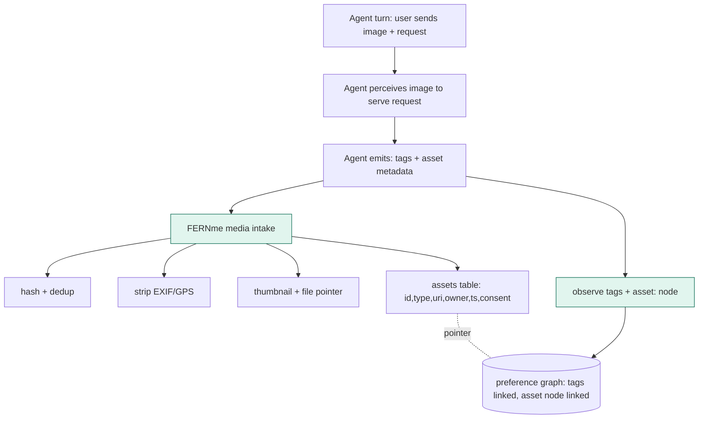
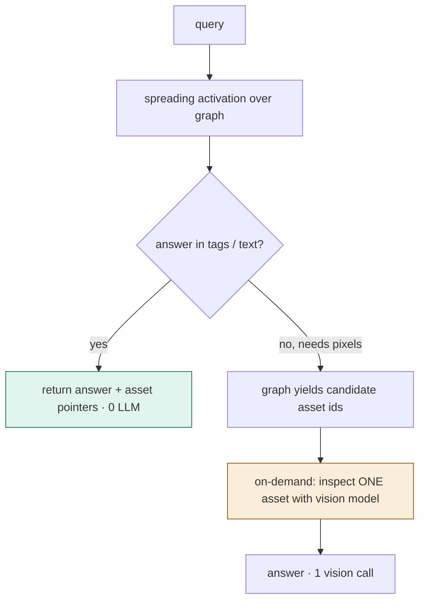

# FERNme-M — Multimodal memory: design map (pre-build)

*Status: design only. Nothing here is implemented. Goal: decide whether/how to add
files (images, video, PDFs, audio) as first-class memory before writing any code.*

---

## 1. The principle (and why it doesn't break FERNme)

FERNme's real claim has never been "no LLM exists in the system." It is **no *extra*
inference call to form memory** — the host agent that is already serving the turn emits
the tags as a byproduct, and FERNme stores them with arithmetic only.

That principle is **modality-agnostic**:

- Text today: the agent reads the user's message to respond → emits tags → FERNme stores. 0 extra calls.
- Images/video next: the agent *already saw the image* to do what the user asked (edit it, answer about it) → emits tags → FERNme stores. **Still 0 extra calls.**

So multimodal memory does not require a new "captioning" step. It rides on perception
the agent was doing anyway. The expensive part — actually *re-examining the pixels* — is
deferred to query time and happens only when a question genuinely needs it
("lazy multimodal reasoning").

**Honest boundary:** this "0 extra call" holds only when an asset passes through an agent
turn. For *silent bulk ingestion* (a user dumps 500 photos into a folder with no
conversation), there is no perception to piggyback on, so that path needs local CV /
metadata / deferred vision. We treat that as a separate, opt-in mode.

---

## 2. Where it fits the current engine

Today's write path (unchanged):

```
event (tags) ──> sanitize ──> vocabulary canonicalize ──> observe()
                                                            ├─ user→attr Hebbian edge (0..9)
                                                            ├─ attr↔attr assoc (Hebb)
                                                            ├─ confidence, salience
                                                            └─ Cabinet (event log)
```

Multimodal adds **one new object type and one new table**, and reuses *everything else*:
the same `observe()`, the same vocabulary, the same graph, the same salience/decay.



The asset becomes a node (`asset:<id>`) that **co-occurs** with its tags, so spreading
activation can hop *tag → asset* and *asset → tag* exactly like any other edge.

---

## 3. Data model

A new first-class object, stored by **pointer** (bytes never go in the graph DB):

```
MediaObject (assets table)
├── id            uuid
├── owner         (site, user)            # multi-tenant, same isolation as edges
├── type          image | video | pdf | audio
├── mime          image/jpeg ...
├── uri           file pointer (blob store / disk / S3) — NOT inline bytes
├── sha256        content hash (dedup, integrity)
├── bytes         size
├── created_ts
├── source        chat | upload | bulk
├── thumbnail_uri small derived preview (images/video)
├── exif_stripped bool                    # privacy: GPS/camera removed
├── sensitive     bool                    # face/medical/screenshot wall
├── consent       per-asset consent flag
└── status        active | tombstoned     # right-to-be-forgotten
```

Linking to memory (reuses existing tables, **no schema churn**):
- Tags from the agent flow through `observe()` as usual → normal attribute edges.
- A synthetic token `asset:<id>` is included in the same event so the asset node
  co-occurs with those tags in the assoc graph.
- Retrieval returns `asset:<id>` nodes; the service resolves them to `MediaObject` rows.

PDFs/documents are special: their **text extracts deterministically** (pdfminer/pypdf,
no model), so they flow straight through the *existing text pipeline* — the cheapest,
highest-value modality.

---

## 4. Write path (zero extra inference)

```
observe_asset(site, user, asset_bytes_or_uri, tags, meta):
  1. hash = sha256(bytes); if exists for owner -> dedup, link, return
  2. strip EXIF/GPS; make thumbnail; write bytes to blob store -> uri
  3. row = assets.insert(type, uri, sha256, ..., consent)
  4. tags' = vocabulary.canonicalize(tags + meta-derived tags)   # man-in-nature -> topic:nature, media:portrait
  5. observe(site, user, "asset", {tags: tags' + ["asset:"+id]}, salience=...)   # SAME write path
  # NO vision model called here
```

- LLM calls by FERNme: **0** (tags came from the agent's existing perception).
- For PDFs: step 4 becomes deterministic text-extract → existing tagger; still 0.

---

## 5. Retrieval path (lazy interpretation)



- Most retrieval: 0 LLM (tags/text already answer it; assets returned as links).
- "What color was the solution?": graph finds the right image via its links, then **one**
  vision call on that single asset. Never a scan of the whole library.

Three levels, made explicit:
- **L1** text/preferences/facts/relationships/actions — near-zero LLM. *(today)*
- **L2** images/video/pdf/audio stored as linked assets — near-zero LLM. *(new)*
- **L3** on-demand understanding — 1 vision call only when a question needs pixels. *(new)*

---

## 6. New components

| Component | What | LLM? |
|---|---|---|
| `fernme/media.py` | MediaObject, hashing, EXIF strip, thumbnailing, PDF text-extract | none |
| store: `assets` table (+ blob pointer convention) | persist asset rows; bytes in blob store, not the DB | none |
| `service.observe_asset()` / `get_asset()` / `recall_assets()` | intake + retrieval, reuse `observe()` | none |
| `service.inspect(asset_id, question)` | pluggable **on-demand** vision hook (like the optional tagger/enricher) | 1 (only here) |
| REST + MCP: `upload`, `link_asset`, `inspect` | agent/host integration | none on write |
| optional `local_perception` (CV/embeddings) | for silent bulk ingestion only | local model, no LLM |

Everything except `inspect()` and the optional local perception is **LLM-free**.

---

## 7. Privacy & safety (this is the hard part)

Media is far more sensitive than tags. The design must treat it as such:

- **Strip EXIF/GPS on intake** (location leakage is the #1 image PII risk).
- **Per-asset consent** + the existing consent gate; bytes stored by pointer so
  `forget_everywhere` deletes the file *and* the row *and* the edges.
- **Sensitive-media wall**: faces, medical images, screenshots flagged `sensitive=true`,
  excluded from the cross-surface supernode by default (same default-deny model as
  sensitive text categories).
- **Encryption at rest** for the blob store; the graph DB holds only pointers + hashes.
- **No bytes cross the privacy boundary** without explicit share — cross-surface supernode
  shares *tags*, never the file, unless the user opts in.
- **Injection via filenames/EXIF/captions** sanitized through the existing untrusted-input
  layer.

---

## 8. Advantages

- **Kills the "only text" criticism** — the single most common reviewer/HN objection.
- **Preserves the core claim**: 0 extra inference on write (byproduct of agent perception).
- **Unifies modalities under one graph** — assets link via the same edges/salience/decay;
  no second memory system.
- **Lazy interpretation** is genuinely cheap and novel-in-combination: graph-linked assets +
  on-demand vision means you pay for understanding only when asked.
- **PDFs are almost free and high-value** (lab notes, contracts, papers) — deterministic text.
- **Clean second paper** (FERNme-M) framed as *zero-LLM multimodal formation*, not asset storage.

## 9. Disadvantages / risks (honest)

- **It changes FERNme from "tiny + flat" to "holds files."** Today the whole memory is a
  ~40-token card + a small graph. Now you own a **blob store**: storage, backups, GC,
  large-data movement, cost. This is the biggest architectural shift.
- **Privacy/legal surface explodes** — faces, GPS, medical images, screenshots of private
  data. The whole pitch is "safe + user-owned"; multimodal must not undermine it.
- **Tag quality depends on the agent.** If the agent emits sloppy/inconsistent tags, the
  image is poorly linked and hard to retrieve. Vocabulary drift is worse for visual concepts.
- **Silent/bulk ingestion isn't free** — no agent in the loop means local CV or deferred
  vision (cost reappears). Must be a clearly separate, opt-in mode.
- **Visual recall is limited to descriptions** until a vision call happens; "find the red
  solution" depends on good candidate recall from the graph.
- **Scope creep before the core is validated.** The honest answer to "only text" is *also*
  a real-user pilot; adding an unproven multimodal layer first dilutes focus and doubles
  the test/maintenance surface.
- **Cross-surface + media = heavy sync** if not pointer-only.

## 10. What it does NOT break (reassurance)

- The text memory card stays ~40 tokens; assets are returned as **links**, not stuffed into
  the prompt. Flat-cost claim survives.
- `observe()`, vocabulary, salience, decay, stores' edge tables — **unchanged**. This is
  additive: a new table + a few service methods, gated by config, off by default.

---

## 11. Phased plan (recommended)

- **Phase 0 — Documents (do first).** PDF/text-extractable files via deterministic
  extraction → existing pipeline. Near-zero cost, highest value, smallest privacy delta.
  Answers "only text" for a huge class of real assets immediately.
- **Phase 1 — Images/video as linked assets.** Agent-emitted tags + metadata, EXIF strip,
  thumbnails, pointer storage, the `inspect()` on-demand vision hook. Config-gated, off by default.
- **Phase 2 — Optional local perception.** CV/embedding models for silent bulk ingestion,
  for users who want pixel-grounded recall without an agent in the loop.

**Gate everything behind config; off by default; build *after* a real-user pilot of the
core.** Same discipline as salience.

---

## 12. Open decisions (for you to weigh)

1. **Blob store**: local filesystem pointer (simplest, single-host) vs. S3/object store
   (scales, ops) vs. user-owned storage (most "user-owned," hardest). Affects the whole shape.
2. **Asset node vs. asset-as-event**: model the asset as a graph node (`asset:<id>`) or
   purely as a Cabinet event referenced by tags? (Leaning: lightweight node, for hop-back retrieval.)
3. **Scope for v1**: documents-only (Phase 0) vs. documents + images (Phase 0+1)?
4. **Is this v0.2 or a separate repo/paper (FERNme-M)?** Recommend: roadmap note now,
   Phase 0 after pilot, full FERNme-M as the second paper.
5. **Default posture**: off-by-default config flag (recommended) so the core stays unchanged.

---

## 13. Effort estimate

- **Phase 0 (PDFs):** ~1 day. `media.py` extract + `assets` table + `observe_asset` for docs
  + tests. Low risk, no new infra (text path reused).
- **Phase 1 (images/video):** ~3–5 days incl. blob-store decision, EXIF strip, thumbnails,
  `inspect()` hook, REST/MCP, privacy tests. Medium risk (storage + privacy).
- **Phase 2 (local perception):** open-ended; depends on chosen CV/embedding stack.

---

### One-line summary

> Add files as **graph-linked memory objects** whose tags come from the agent's *existing*
> perception (0 extra inference), store bytes by pointer with EXIF stripped, and call a
> vision model **only on demand** for questions that need pixels. Additive, config-gated,
> off by default — start with PDFs, after a real pilot.
