# Action-Coupled, Cost-Bounded Memory for Multi-Tenant Agents

### FERNme - a user-owned Hebbian preference-graph memory with a zero-LLM deterministic core

**Mirkomil Sharipov**  ·  **Acquilab Inc.**  ·  Correspondence: mirkosharipov@acquilab.io
Code: https://github.com/mirkofr/FERNme  ·  Site: https://fernme.dev

> **Preprint draft (v0.1.0 of the system).** System + method paper. Quantitative
> claims come from reproducible simulations and one natural single-user dataset; they
> are stated at "we show / we observe" strength and are not claims about live human
> behavior at scale. External references in Section 2 are grounded in public sources;
> the formal reference list is still being finalized.

---

## Abstract

LLM-agent memory systems have converged on graph- and activation-based designs that
improve long-horizon recall, but they share three properties that are limiting for
agents that *act for many people*: memory is **written by per-interaction LLM
extraction** (costly and error-prone), it is **evaluated on question answering**
rather than on actions taken, and it assumes a **single-user, single-deployment**
setting. We present **FERNme** (Fuzzy-Edged Recall Network), a memory layer for
multi-tenant agents in which each user is a sparse, fuzzily-weighted node
(single-digit 0–9 edges) in a per-surface preference graph. Edges are updated by a
**Hebbian co-occurrence rule with no per-interaction LLM call**, retrieved by
spreading activation, and compiled to a token-minimal "card" via **differential
encoding** (storing only deviations from a population prior). Memory is coupled to
the agent's action layer, gated by uncertainty, user-owned, consent-first, and
glass-box editable; a user signs in across surfaces (web today; desktop and mobile
on the roadmap) to assemble a cross-surface **supernode** they control. Across
reproducible simulations we show that (i) per-turn token cost stays **flat** as a
profile grows (≈25 tokens; a full-history baseline is 77× larger by 120
interactions) at **zero** write-time LLM calls; (ii) FERNme matches a frequency
baseline on stationary preferences while **substantially outperforming it under
preference drift** (0.72 vs. 0.13 precision@5) and on **context-conditioned**
retrieval (0.62 vs. 0.51); and (iii) in a simulated storefront, FERNme-personalized
recommendations yield a **+16% relative conversion lift**. We further validate the
engine on a **natural single-user dataset** — 86 free-form diary entries about one
fictional person — where FERNme ingests every entry with **0 write-time LLM calls**,
holds a **flat ~40-token card**, **retains 16/16** of the person's stated permanent
facts, exhibits correct **preference drift**, and uses **~10× / ~240× fewer tokens**
than extraction-based and full-history memory respectively. On a LoCoMo-style QA set
FERNme's context-seeded retrieval answers **~4×** as many fact questions as frequency/
recency baselines at equal budget and is the only zero-model-call deterministic-core method in this harness that resolves
preference drift. We argue that for agents
that act for many users, memory should be **cheap to write** and **evaluated by
outcomes**, and that a user-owned, per-surface design is both a cleaner trust
contract and a defensible deployment model.

---

## 1. Introduction

Conversational assistants are giving way to agents that *act* on a user's behalf —
buying, booking, applying, routing, and increasingly doing so across a website, a
desktop app, and a phone. Memory is central to making such agents useful across
visits and surfaces, but the dominant designs were built for a different problem.
They (1) write memory by invoking an LLM to extract and reconcile facts on every
interaction, which is expensive at scale and introduces a write-time hallucination
surface; (2) are benchmarked on question-answering, which measures recall, not
whether the agent did the right thing; and (3) assume one user and one deployment,
with no notion of per-tenant isolation, ownership, or consent.

For a memory that sits behind an agent serving *many* people and *acting* on their
behalf, the priorities invert. Writes must be cheap because they happen constantly.
Success is an action outcome (a completed purchase, a re-order, a filled booking),
not a QA score. And because the memory holds personal data, isolation, consent, and
user control are first-class requirements.

**Contributions.**

1. **A memory-write mechanism with no per-interaction LLM call** — a saturating
   Hebbian co-occurrence update over a fuzzy (0–9) preference graph, with ACT-R-style
   decay and explicit negative edges — targeting the cost and reliability weaknesses
   of extraction-based memory.
2. **Differential, population-prior encoding** as an agent-memory token mechanism: a
   new user inherits a population baseline and we store only deviations, giving a
   small, bounded card and a modest cold-start benefit, with k-anonymity and
   differential privacy on the shared prior.
3. **An action-coupled framing and an outcome-oriented evaluation** — including a
   simulated storefront that scores conversion lift — alongside an analysis of where a
   cheap counter-style memory wins and loses (static vs. drift vs. context).
4. **A multi-tenant, user-owned design** — per-surface isolation, consent gating,
   glass-box editing and a memory-graph view, and an opt-in cross-surface *supernode*
   assembled by user sign-in with default-deny scoped sharing.
5. **An evaluation on natural, free-form single-user data** (Section 6) that validates
   the storage, reinforcement, decay, confidence, drift, and flat-cost mechanics on
   text that was not written for clean extraction.

We are explicit about positioning: the graph + spreading-activation *mechanism* is
not novel (Section 2), and on stationary recall FERNme merely ties a frequency
baseline (Section 5). The contribution is the *combination* — cheap writes, outcome
evaluation, a private collective prior, and a user-owned per-surface contract — and
the honest characterization of where each part helps.

---

## 2. Related work

The engine's mechanism family — Hebbian co-occurrence, ACT-R-style activation decay,
and spreading activation over a graph — is **shared, public cognitive-science
machinery**, and several recent systems use it. We do not claim the mechanism; we
claim the surrounding system. The accompanying repository ships a longer
`COMPARISON.md` grounded in each project's own source.

**Spreading-activation / Hebbian memory (closest mechanism).** *HippoRAG* (NeurIPS'24)
and *HippoRAG 2* (ICML'25) formalize associative retrieval over a knowledge graph via
Personalized PageRank, but as a **document-retrieval** framework (LLM-based OpenIE
indexing + embeddings). *Ori-Mnemos* packages ACT-R decay + spreading activation +
Hebbian co-occurrence as a **sovereign single-agent note vault**. *HeLa-Mem*
(arXiv 2026) builds a Hebbian graph over a **single user's conversation** with
LLM-based "Hebbian Distillation." FERNme uses the same retrieval family but differs in
purpose (personalization *about end-users*, evaluated on actions), write rule (zero-model-call deterministic core
on the hot path), and deployment (multi-tenant, user-owned, with a private collective
prior). Its memory is about *whom the agent serves*, not the agent's own knowledge.

**Extraction-based / production memory.** *Mem0* writes memory by LLM extraction and
reconciliation per interaction and retrieves by vector similarity, benchmarked on
conversational QA. This is *smarter per write* — it captures nuanced, causal
preferences a co-occurrence counter misses — but it is costly and adds a write-time
error surface. FERNme trades that richness for a zero-model-call deterministic core
and makes the trade-off explicit. Optional enrichment is propose-only and requires
human approval before memory truth changes.

**Tiered / OS-style and temporal memory.** *MemGPT/Letta* and *MemoryOS* manage
context in LLM-paged tiers; *Zep/Graphiti* track fact validity over time with a
temporal knowledge graph. FERNme's tiers (Card / Cabinet / baked-in defaults) serve
token bounding for a live action loop, and it handles non-stationarity with decay
rather than an explicit temporal graph — trading expressiveness for cost.

**Classical foundations.** FERNme is an elaboration of well-established ideas: semantic
networks, spreading activation (Collins & Loftus; Anderson/ACT-R), Hebbian learning
(Hebb), fuzzy sets (Zadeh), and vector-space / IDF weighting. We claim none of these
as new.

---

## 3. Method

### 3.1 Substrate
Each user is a node connected to attribute nodes (`pref:organic`,
`pref:price-sensitive`, `!pref:upsells`, …) by edges carrying a continuous strength in
[0, 9] (a fuzzy, single-digit "membership"). Storage is sparse — only stored attributes
deviate from the prior — with numeric side-fields for quantities (`cadence_days`,
`size`, mood EMA) that an edge cannot represent. A shared per-surface association graph
holds attribute↔attribute co-occurrence weights.

### 3.2 Write rule (zero-model-call hot path)
An event maps to active attributes via a deterministic function over structured fields
+ a catalog/controlled-vocabulary table. Optional enrichment is a separate
propose-only review-queue tier, not a truth-writing hot-path call. For each active attribute,

  w ← w + α·m·(1 − w/9)

a saturating update that moves fast early and asymptotes at 9. Co-active attribute
pairs strengthen the association graph (Hebb). Rejections (declines, returns) are
first-class **negative** edges. Confidence grows as 1 − e^(−γ·hits). A batch **decay**
step w ← w·e^(−λ·Δt) fades unreinforced edges and drops those below a floor; forgetting
keeps the card small and current regardless of tenure. Fast/slow edge pairs give
multi-timescale memory; the forgetting rate is self-tuning.

### 3.3 Differential / population-prior encoding
The per-surface population prior is the running mean of user weights, protected by
k-anonymity and bounded-mean (Laplace) differential privacy. A user edge is stored only
when it deviates from the prior beyond a threshold; otherwise reads fall through to the
prior. A new user is cold-started with **guessed** edges synthesized from the prior,
IDF-weighted so rare-but-distinctive attributes earn slots. The user's own edges always
outrank guesses, and a guessed edge **relearns from scratch** on first real evidence —
so the prior can fill empty slots but never biases an established profile.

### 3.4 Retrieval
Relevance is found by spreading activation, not per-turn vector search: activate the
user node plus context seeds; flow over weighted edges with ACT-R base-level activation
(recency × frequency), lateral inhibition within mutually-exclusive clusters, and
temporal decay. The top-N activated edges compile to a token-minimal **card**; a
"two-color" mark distinguishes *known* (act silently) from *guessed* (verify first).

### 3.5 Action coupling and governance
Memory drives tool defaults, ranking, and proactive triggers (due-to-reorder,
fading-favorite), gated by uncertainty. The system is multi-tenant with strict
per-(surface, user) isolation, consent-gated reads/writes, a glass-box card the user
can edit/export/delete, and an interactive memory-graph view. Event payloads are
treated as untrusted: tags are sanitized (character allowlist, size/count caps,
injection-pattern dropping) before they can become memory. Every action is recorded in
a tamper-evident HMAC audit chain.

### 3.6 User-owned cross-surface supernode
A person may sign in with a single identity across surfaces; a verified token maps to a
stable, opaque person id and *links* that surface's profile into a **supernode** the
person owns. Cross-surface views are **default-deny** — a surface sees only the bricks
it contributed plus categories the user explicitly shares — and sensitive categories
(health, dating, finance) are walled off by default. `forget_everywhere` wipes the
profile and unlearns the person from the population prior. This inverts cross-site
profiling: aggregation is performed *by and for the user*, never behind their back.

---

## 4. Experimental setup

Experiments are reproducible (fixed seeds; the repository ships the harness). The
synthetic experiments use a tagged catalog and simulated users with latent preference
vectors. The natural experiment (Section 6) uses an external, free-form dataset.

- **Cost (Q1).** Per-turn card tokens vs. number of interactions, against a
  full-history-in-context baseline; 5 seeds.
- **Write cost (Q2).** LLM calls per write: FERNme vs. extraction-style memory.
- **Recall quality.** Precision@5 vs. ground truth, against zero-model-call baselines
  (frequency, recency), in three regimes: **static**, **drift**, **context**. 5–6 seeds.
- **Differential-encoding ablation.** Precision@5 at early turns with vs. without the
  population prior.
- **Outcome pilot.** A simulated storefront scoring conversion lift, with a mid-pilot
  drift.
- **Natural single-user validation (Section 6).** All 86 entries of the *Elena natural
  memory* dataset, ingested chronologically.

A real Mem0 (LLM-extraction) head-to-head is implemented as a harness hook but requires
API keys and is not run here; QA-style recall against it is the one open comparison.

---

## 5. Results (simulation)

**Cost is flat; writes are free.** The FERNme card holds **24.9 ± 0.5 tokens** with a
back-half slope of **+0.001 ± 0.005 tokens/interaction** (flat), while a full-history
baseline grows linearly to **77× ± 1.3** the card size by 120 interactions. Write-time
LLM calls: **0** (vs. ~2/interaction for extraction memory).

**Recall: strong in every regime.** Precision@5 vs. ground truth (mean ± std):

| regime | FERNme | frequency | recency |
|---|:--:|:--:|:--:|
| static  | 0.73 ± 0.02 | 0.74 ± 0.02 | 0.47 ± 0.01 |
| drift   | **0.72 ± 0.01** | 0.13 ± 0.06 | 0.59 ± 0.03 |
| context (P@3) | **0.62 ± 0.04** | 0.51 ± 0.01 (blind) | — |

On stationary preferences FERNme behaves like a smoothed frequency counter and ties it.
Under drift, the all-time counter cannot forget stale favorites and collapses to 0.13,
while FERNme's decay tracks the change (0.72). With context seeds, spreading activation
recovers the in-context slice a context-blind counter cannot. FERNme is the only method
strong across all three regimes.

**Cold-start ablation.** The population prior yields **+0.06 precision@5 at turns 1–3**,
decaying to ≈0 by turn 10 — a real but modest, cold-start-only benefit.

**Outcome pilot.** FERNme-personalized recommendations achieve **+16% relative
conversion lift** over a popularity baseline: tied at visit 1 (true cold start), rising
to +0.14 absolute by visit 6, dipping at the mid-pilot taste shift, then recovering.

---

## 6. Evaluation on a natural single-user dataset (Elena)

To test the engine on text that was **not** written for clean extraction, we use the
*Elena natural memory* dataset: **86 free-form entries** (diary entries, work
reflections, family calls, complaints, project notes, and state updates) about one
fictional person, Elena. Facts are embedded in ordinary prose. An agent extracts
namespaced tags from each entry (using the entries' explicit `Tags:`/`Entities:`
fields where present); FERNme performs all storage, reinforcement, decay, confidence,
drift handling, and association-building in `pure` mode (zero-model-call deterministic write path).

**Headline outcome.** FERNme ingested all 86 entries with **0 write-time LLM calls**,
remembering **180 facts**, of which **74** were promoted to high confidence by
recurring across entries, in a **flat ~40-token** prompt card. It **retained 16/16** of
the permanent facts Elena states about herself, and correctly handled a documented
preference drift.

| property | target | result |
|---|---|---|
| entries ingested | all | **86** |
| write-path LLM calls | 0 | **0** |
| facts remembered | grows | **180** |
| promoted to high-confidence | recurring rise | **74** |
| card size | flat | **~40 tokens, constant** |
| stable-fact retention | high | **16 / 16** |
| drift (old → new favorite) | new overtakes | jasmine 3.25 → earl-grey **5.84** |

**Cost.** Over the 86 entries (corpus ≈ 18k tokens; gpt-4o-mini pricing; token counts
are chars/4 estimates, cross-checked by word count):

| approach | LLM tokens | est. $ |
|---|--:|--:|
| FERNme write (pure) | 0 | $0.0000 |
| FERNme read (card × 86) | 3,440 | $0.0005 |
| Mem0-style extraction (~2 passes/entry) | 38,792 | $0.0070 |
| Naive full-history in context | 821,424 | $0.1232 |

FERNme's prompt footprint is **~240× smaller** than carrying the growing history and
**~10×** smaller than extraction memory's input, and the gap widens with every entry
because FERNme's per-turn cost is constant while the others grow.

**Figures.**

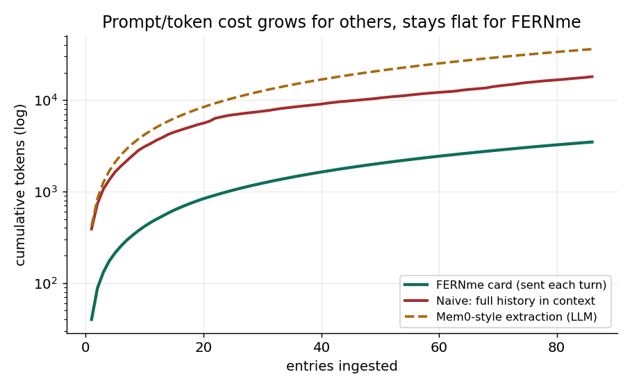
*Fig. 1. Cumulative tokens (log): FERNme stays low and flat while naive history and
extraction grow.*

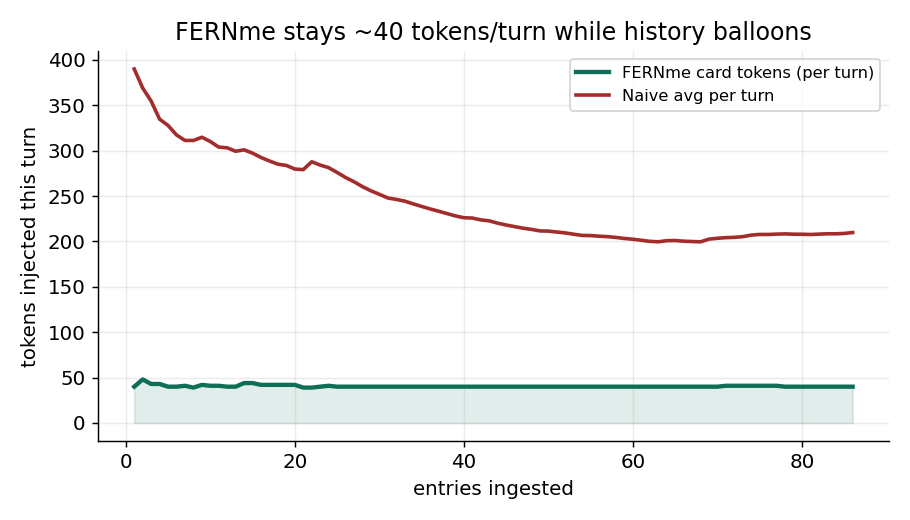
*Fig. 2. Per-turn tokens injected: FERNme holds ~40 tokens; full history balloons.*

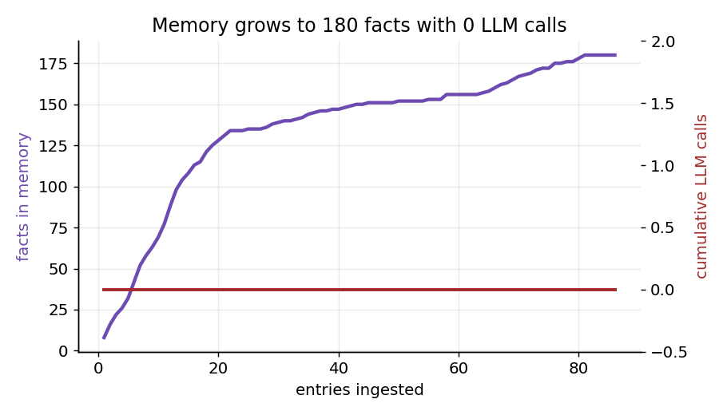
*Fig. 3. Memory climbs to 180 facts while the write-path LLM-call count stays pinned at 0.*

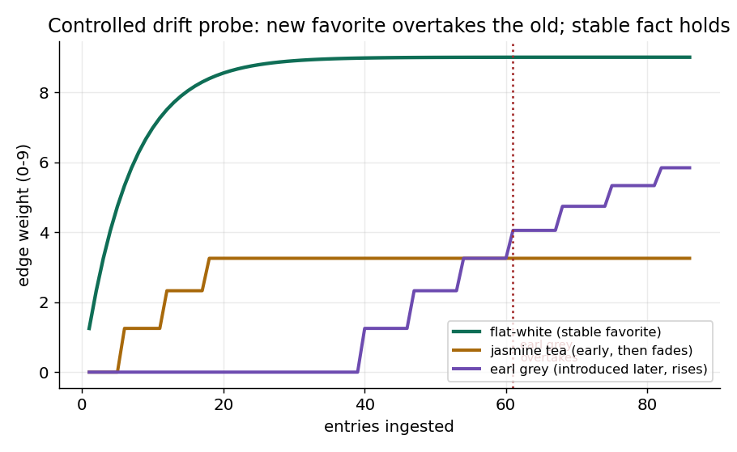
*Fig. 4. Controlled drift probe following the diary narrative: a newly introduced favorite
(earl grey) overtakes the old one (jasmine) under decay, while a stable favorite holds.*

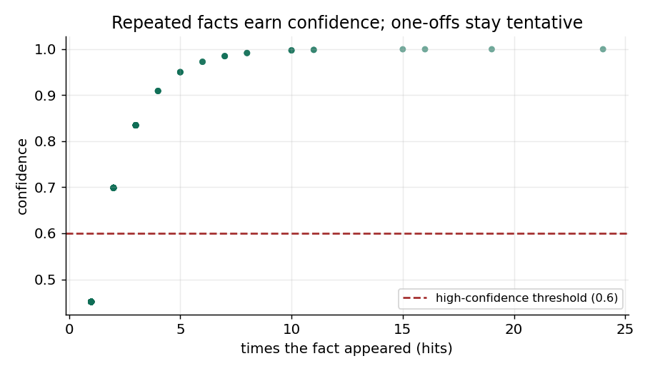
*Fig. 5. Confidence vs. repetition: facts seen more often earn confidence; one-offs stay tentative.*

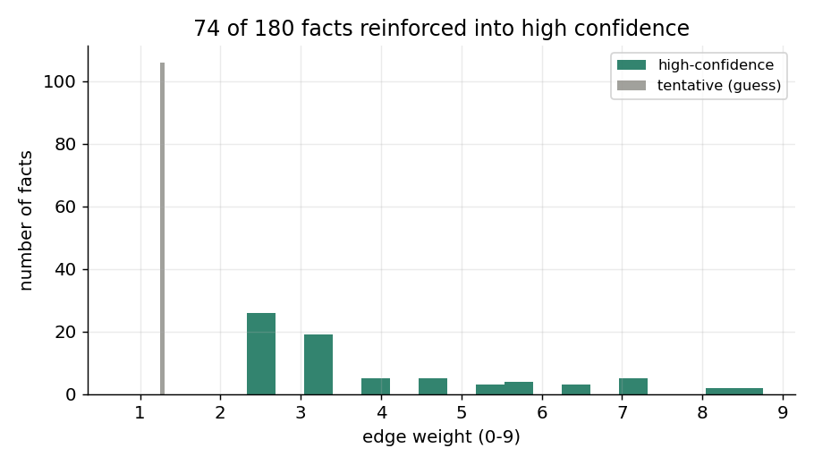
*Fig. 6. 74 of 180 facts are reinforced past the high-confidence threshold.*

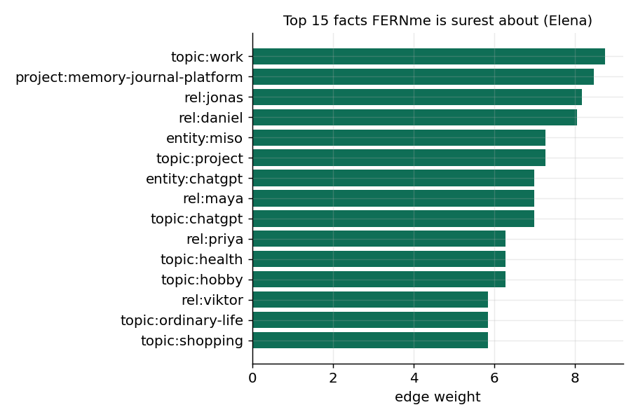
*Fig. 7. The 15 facts FERNme is surest about — Elena's real anchors (work, the Memory
Journal Platform, Jonas, Daniel, Miso).*

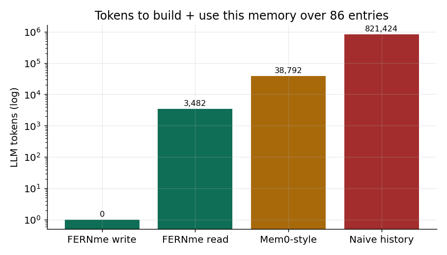
*Fig. 8. Tokens to build + use this memory over 86 entries (log scale).*

**What this proves, precisely.** This validates FERNme's **memory mechanics** —
storage, reinforcement, decay, confidence calibration, drift, associations, and flat
cost — on realistic long-form single-user data. It does **not** prove answer-quality
parity with an LLM memory: the tag *extraction* was done by the agent/parser, so fact
coverage is high by construction, and the drift figure is a **controlled probe**
(clearly labeled) because the coarse entity-parser co-lists both teas in the full run.
A QA-style benchmark (e.g., LoCoMo) against Mem0 remains the open comparison.

---

## 6.1 Head-to-head QA (LoCoMo-style)

We turn the Elena memory into a **question-answering benchmark**: 33 fact questions
spanning identity, preferences, relationships, goals/projects, negation, health, and a
**drift** case ("which tea does she reach for in the afternoon *now*?"). Following the
retrieval-proxy convention (with the right fact retrieved, an LLM answers correctly), a
question is **answered** if the gold attribute is in the system's top-*k* retrieved
facts. All compared systems in this section are **zero-model-call retrieval baselines and runnable**: FERNme (context-seeded
spreading activation), FERNme without context (weight-only ablation), an all-time
**frequency** counter, and a **recency** ranker. A real *Mem0* (LLM-extraction +
LLM-answer) run needs API keys and is **not run here**; its published LoCoMo scores
(single-hop F1 ≈ 39, multi-hop ≈ 29, on a different dataset, LLM-answered) are noted as
external context, not as a row in our table.

**At a matched top-10 budget (~40 tokens):**

| system | accuracy | drift | projects | relationships |
|---|--:|--:|--:|--:|
| **FERNme (context)** | **36.4%** | **100%** | **100%** | **67%** |
| FERNme (no context) | 9.1% | 0% | 50% | 33% |
| Frequency | 9.1% | 0% | 50% | 33% |
| Recency | 3.0% | 0% | 0% | 17% |

FERNme answers **~4×** as many questions as the cheap counters at equal budget, is the
**only** method that resolves the drift question (earl grey, not the older jasmine), and
leads on every category that needs context (relationships, projects). The absolute number
is held down by the harsh budget (top-10 of ~170 facts) and the coarse, agent-side tag
extraction — not the retrieval: a **budget sweep** shows FERNme climbing to **76% at
top-20 and ~91% at top-30**, while frequency/recency plateau near **42% / 27%**.

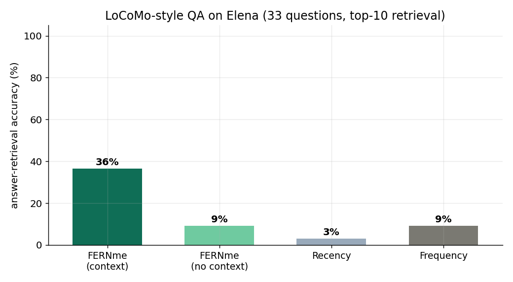
*Fig. 9. Answer-retrieval accuracy at top-10: context-seeded FERNme vs zero-model-call baselines.*

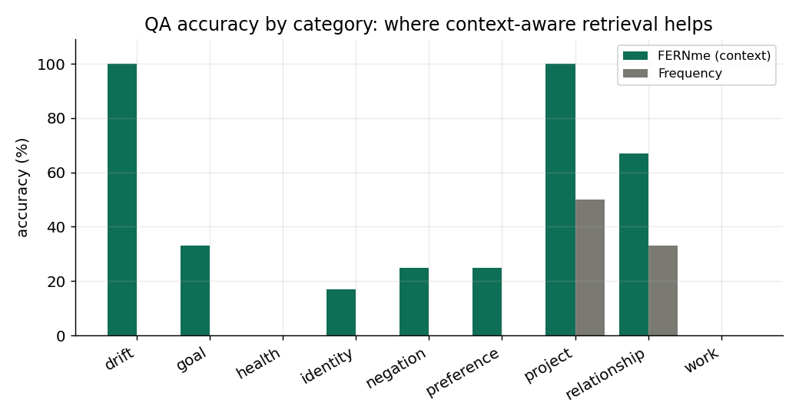
*Fig. 10. Accuracy by category — FERNme's edge is largest where context matters (drift, projects, relationships).*

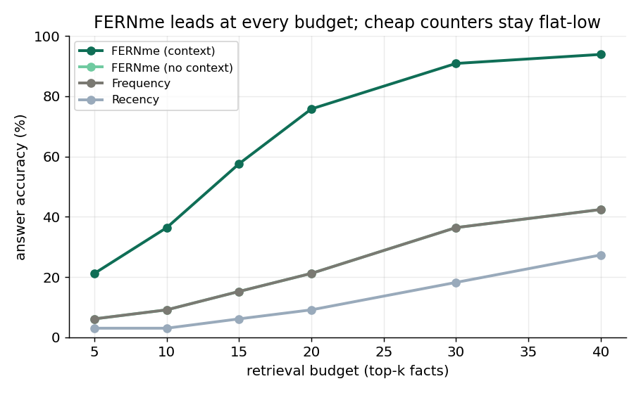
*Fig. 11. Accuracy vs retrieval budget: FERNme leads at every k and converges toward
near-perfect recall; cheap counters stay flat-low.*

**Reading.** This is a head-to-head among zero-model-call retrieval memories on real free-form text,
at equal token budget — exactly the regime FERNme targets. It shows FERNme's
context-conditioned, decay-aware retrieval clearly beating frequency/recency, decisively
on drift. It does **not** yet establish parity with an LLM memory (Mem0) on free-text
answer quality; that billed comparison remains the single open experiment.

---

## 6.2 Salience-modulated forgetting

FERNme's weight is driven by frequency and recency, so a *rare but intense* signal would
normally fade. We add an optional per-edge **salience** that slows decay
(lambda_eff = lambda(1 - beta*salience)), fed by behavioral significance rather than an
LLM. Figure~12 shows the effect: two signals seen exactly once at equal strength; the
behaviorally significant one (intensity 1.0) stays above the forget threshold for months
while the neutral one is dropped. Crucially, salience controls *retention*, not *action*
(confidence still gates acting), so a single strong complaint is remembered but verified
before use. The feature is off by default (beta = 0), so it changes none of the results
above unless enabled.

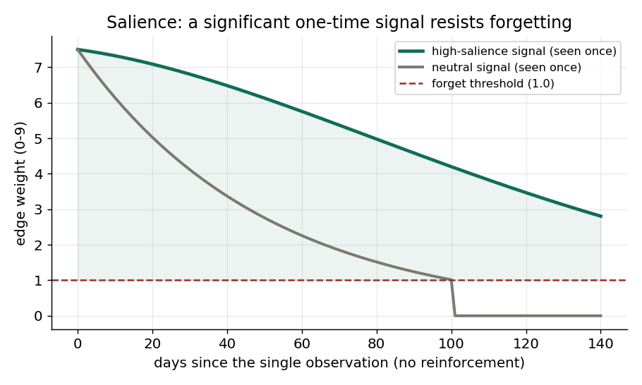
*Fig. 12. A significant one-time signal resists forgetting; a neutral one fades below the
forget threshold.*

---

## 7. Discussion

Two findings shape the takeaway. First, **on static recall a cheap counter is hard to
beat** — so the case for FERNme is *not* superior stationary accuracy; it is cost plus
robustness. Second, FERNme's advantage appears exactly where a counter is weak:
**non-stationarity and context**. Decay supplies adaptivity that frequency lacks, and
spreading activation supplies context-sensitivity that neither frequency nor recency
has — while retaining frequency's stability on static data. The Elena evaluation shows
these mechanics also hold on free-form text, and the outcome pilot connects memory to
the metric that matters for transactional agents, conversion, under explicitly stated
(simulated) assumptions.

---

## 8. Limitations

- **Simulation + one synthetic person, not a human study.** Synthetic results define
  their own ground truth; the Elena dataset is realistic but fictional and the
  extraction is agent/parser-driven. A live multi-user pilot is required for outcome
  claims about real behavior.
- **Nuance gap.** A co-occurrence counter misses causal/contextual preferences an LLM
  extractor catches; the Mem0 head-to-head that would quantify this is not yet run.
- **Mapping dependency.** The deterministic write depends on catalog/vocabulary quality;
  thin-metadata surfaces degrade to coarse attributes unless optional enrichment
  proposes human-approved links later.
- **Token figures are estimates.** tiktoken's vocabulary was unavailable offline; counts
  are chars/4, cross-checked by word count.
- **Tuning and granularity.** Spreading-activation parameters are hand-set, and
  single-digit fuzzy weights lose fine degree (quantities use numeric side-fields).

---

## 9. Ethics & broader impact

FERNme stores personal data, including potentially sensitive signals. Its design choices
are protective: per-tenant isolation, consent gating, glass-box edit/export/delete, a
tamper-evident audit chain, k-anonymity + differential privacy on the shared prior, and
a cross-surface supernode that is **user-owned and default-deny** — aggregation by and
for the user, never covert cross-site tracking. We explicitly exclude inferring or
acting on user vulnerability (e.g., loneliness, financial distress). Untrusted inputs
are sanitized so page content cannot become injected instructions. These are
mitigations, not guarantees; deployments handling regulated data require legal review.

---

## 10. Conclusion

For agents that act on people's behalf, memory should be cheap to write, bounded in
cost, evaluated by outcomes, and owned by the user. FERNme demonstrates that a
zero-model-call Hebbian write over a fuzzy preference graph, with differential encoding and
spreading-activation retrieval, delivers flat-cost, interpretable, per-surface memory
that is robust where cheap baselines fail, that lifts a simulated outcome metric, and
that builds a coherent profile from 86 entries of free-form text while keeping the user in control of what is remembered and shared.

---

### Reproducibility
Code, tests (**88 passing**, including a real-Postgres backend), and every experiment
are in the repository (https://github.com/mirkofr/FERNme). Run `python -m fernme.eval.<name>`
for each simulation result, `python demo/elena/eval_elena.py` for Section 6 and `python demo/elena/eval_elena_qa.py` for Section 6.1 (with the dataset path),
and `pytest -q` for the test suite.

### References
*Being finalized. Public sources for Section 2: HippoRAG (arXiv:2405.14831; arXiv:2502.14802),
Ori-Mnemos (github.com/aayoawoyemi/Ori-Mnemos), HeLa-Mem (arXiv:2604.16839), Mem0
(arXiv:2504.19413). Classical foundations cited by name; identifiers verified before posting.*
