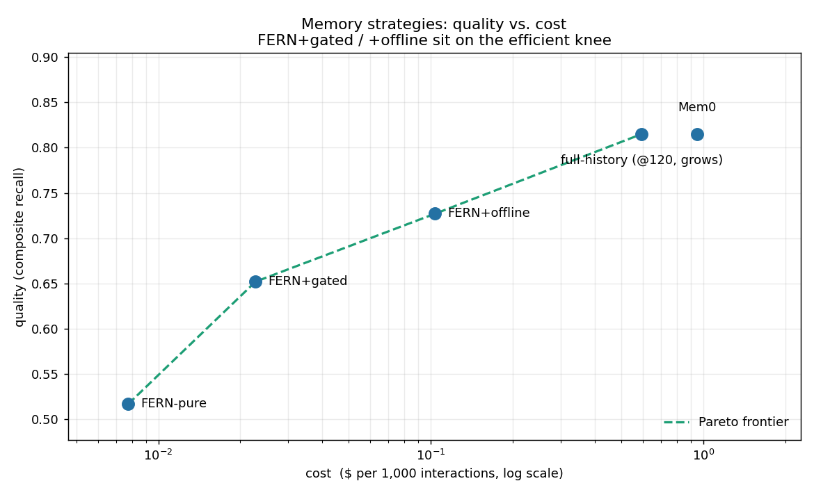

<div align="center">

# 🌿 FERNme

### Fuzzy-Edged Recall Network

*Agent personalization memory that models the user, not the transcript.*

**A user-owned, near-zero-LLM personalization memory layer for AI agents. It turns consented interactions into an inspectable model of each person's preferences, habits, communication style, and constraints — staying token-flat as it grows, while letting people see, edit, delete, and own what agents use to personalize.**

[](LICENSE)
[](https://fernme.dev)
[](https://www.python.org/)
[](#-honest-status)
[](#-architecture)
[](#-honest-status)
[](https://pepy.tech/projects/fernme)

*Cheap to write · flat to read · interpretable by design · owned by the user*

[**fernme.dev**](https://fernme.dev)

</div>

---

## ✨ The one-paragraph pitch

Most agent memory is **written by an LLM on every turn** (expensive, hallucination-prone), **evaluated on question-answering** (not actions), and **assumes a single user**. FERNme is built for the opposite world — agents that *act* for *many* people, in any domain (a sale, a booking, a resolved ticket, a completed lesson, a kept appointment — "outcome" is whatever the goal is). It starts where agents already act today — websites — and builds a user-owned personalization model the person can inspect and control. Each user is a sparse, fuzzily-weighted node in a per-site graph; the graph now also supports opt-in typed entities with labeled, Hebbian-weighted relations — who people are and how they connect — while still keeping zero LLM calls in the write path. Retrieval is **spreading activation**, and the prompt-facing "card" stores only **deviations from a population prior**. The result: per-turn cost stays flat as a profile grows for years, the user can read and correct what agents use to personalize, and the same engine assembles — only with the user's consent — into a cross-site **supernode** they fully control.

---

## What it is / is not

| FERNme is | FERNme is not |
|---|---|
| A user-owned personalization memory layer for agents | A generic transcript store |
| A fuzzy graph of preferences, habits, style, constraints, and outcomes | A folder of chat logs with search |
| Deterministic-first memory writes with optional LLM enrichment | An LLM extraction call on every turn |
| A bounded prompt card that stays small as memory grows | Full-history injection |
| An inspectable and editable user model | Hidden behavioral profiling |
| Consent-first, per-site, default-deny sharing | Cross-site surveillance |

---

## 🎯 Why FERNme (the strong points)

| | |
|---|---|
| 🪶 **Zero-LLM writes** | Memory updates are arithmetic on a graph — **0 LLM calls per interaction** vs. ~2 for extraction-based memory. No write-time cost, no write-time hallucination. |
| 📉 **Flat token cost forever** | The prompt card holds **~25 tokens** whether it's a visitor's first day or fifth year. A full-history baseline is **77.4× larger** by 120 interactions. |
| 🧠 **Strong in every regime** | Ties a frequency counter on static recall, **beats it 0.718 → 0.128 on drift**, and **wins on context** (0.617 → 0.513). Class-targeted volatility retention + spreading activation preserve permanent facts without giving stale tastes too much inertia. |
| 🧬 **Typed people & relations** | Entities with aliases, contact fields, and labeled relations (`ceo_of`, `family_of`, ...) strengthened Hebbian-style; deterministic path queries; opt-in and byte-identical when off. |
| 🪟 **Glass-box & user-owned** | Every preference is visible and editable. People fix what's wrong, delete everything, or export it. Privacy becomes a feature, not a liability. |
| 🏬 **Built for outcomes** | Evaluated by **conversion**, not QA. A simulated storefront shows **+17% conversion lift** vs. non-personalized recommendations. |
| 🧩 **User-owned supernode** | Sign in across sites → your memories assemble like Lego into one profile **you control**, default-deny, sensitive data walled off. Not surveillance — the mirror image of it. |
| 🎚 **Cost/quality dial** | One engine, a `memory_mode` switch: free key-less `pure` by default, opt-in `gated`/`offline` LLM enrichment when you need Mem0-grade nuance — pay only for the compute you use. |
| 🔐 **Verifiable & unlearnable** | Every action is logged in a tamper-evident HMAC chain the user can replay to detect any alteration; `forget_everywhere` wipes the profile **and** unlearns the person from the population prior — provable right-to-be-forgotten. |
| 🛡 **Injection-proof by design** | Writes are arithmetic, not LLM extraction, so page/user text can't be "talked into" becoming a belief — tested that injected instructions never enter memory. |
| 🧠 **Private collective intelligence** | New users benefit from crowd patterns on turn one (cold-start from a population prior), with **k-anonymity + differential privacy** so no individual leaks. A network-effect moat single-user memories can't have. |
| 🗣 **Style & mood memory** | Learns *how* each person communicates (terse/verbose, formal/casual, energy) and tracks their **mood with trend detection**, so the agent can match tone and notice when someone's frustration is rising — in any domain. |
| 🎯 **Outcome-learning, any goal** | Memory is reinforced by *results* — not just recall. `record_outcome(success)` strengthens what worked and weakens what backfired, where "success" is any goal (purchase, booking, resolved ticket, completed lesson…). |
| 🔍 **Explainable** | Ask `why(user, attr)` — get the evidence (observations + good/bad outcomes + dates). No black box. |
| 🔌 **Deployable plumbing** (research preview; harden per SECURITY.md) | SQLite or **Postgres** (tested on real PG 16), REST + **MCP** servers, consent gating, injection-safe writes, proactive triggers — all tested. |

---

## 📊 Benchmarks

> **Honest scope:** the numbers below are on **synthetic or LLM-authored** data, not real
> users. They validate the *mechanism* and surface failures; a real-human pilot is the
> pending next step. The Mem0 (LLM) head-to-head needs an API key and is not yet run.
> Entity-layer validation is currently acceptance-fixture and micro-eval only; a
> real-profile entity benchmark is pending.

### On LLM-authored people (closest to real, agentic ingestion)
A sample of 16 of 92 third-person profiles (ChatGPT-authored), read as **prose only** and
remembered agentically, then scored against hidden answer keys:

| metric | result |
|---|---|
| preference coverage vs. hidden key | **75%** |
| communication style — formality | **100%** |
| mood sign / mood arc | **94% / 100%** |
| preference drift detected | **94%** |
| injection attempts ignored | **100%** |
| note → card compression | **7.3×** |

*(The "agent" here is an LLM reading prose, so these reflect agent + engine together — the
engine is solid; the extraction quality is the agent's.)*

### Cost, recall, and Pareto (synthetic, multi-seed)

> Reproduce: `python -m fernme.eval.cost_variance` · `... quality` · `... drift` · `... context` · `... retention` · `... ablation` · `... pilot` · `... entities`

**Cost** — per-turn memory tokens vs. profile size (5 seeds):

| metric | FERNme | baseline |
|---|---|---|
| card size | **25.1 ± 0.6 tokens** (flat) | full history grows linearly |
| at 120 interactions | **1×** | **77.4× ± 1.3** larger |
| LLM calls per write | **0** | ~2 (extraction memory) |

**Recall quality** — precision@5 vs. ground-truth preferences (5 seeds × 40 users):

| regime | 🌿 FERNme | frequency | recency |
|---|:---:|:---:|:---:|
| static recall | 0.739 | 0.739 | 0.465 |
| **drift** (taste shifts) | **0.718** ✅ | 0.128 ❌ | 0.586 |
| **context** (precision@3) | **0.617** ✅ | 0.513 (blind) | — |

> **The headline:** FERNme is the *only* method strong everywhere. Frequency can't forget (fails drift); recency is noisy (fails static). FERNme's decay + spreading activation get both.

**Cold-start ablation** — population prior gives **+0.06 precision@5 at turns 1–3**, washing out by turn 10 (a real but modest, cold-start-only benefit).

**Typed-entity A2 micro-eval** (`python -m fernme.eval.entities`) — synthetic,
fictional alias-fragmentation fixture. It reports the rank of a fragmented person
entity with `entity_aggregation` off vs. on; no real-profile claims yet.

**Cost / quality Pareto** (`python -m fernme.eval.pareto`) — measured FERNme recall &
tokens, modeled LLM nuance & price (assumptions in-file). Per 1,000 interactions:

| strategy | quality | $/1k | vs Mem0 |
|---|:--:|:--:|:--:|
| FERNme-pure | 0.52 | $0.008 | 122× cheaper |
| **FERNme+gated** | 0.66 | $0.023 | **42× cheaper** |
| **FERNme+offline** | 0.73 | $0.104 | **9× cheaper** |
| full-history@120 | 0.82 | $0.59 (grows) | — |
| Mem0-style | 0.82 | $0.95 | 1× |

FERNme+gated/offline sit on the efficient knee: **~80–90% of the LLM-ceiling quality
at 1–2 orders of magnitude less cost.** (Modeled assumptions; shape is the point.)



**Simulated outcome pilot** — fake storefront, learn-from-behavior shoppers: **+17% relative conversion lift** over a popularity baseline; tied at visit 1 (cold start), pulling ahead as it learns, recovering through a mid-pilot taste drift.

---

## 🎚 Memory modes (one engine, a cost/quality dial)

FERNme ships **one core** with a deployment-level switch — `FernService(memory_mode=...)`.
The default is free, key-less, and tested; LLM modes are opt-in and pluggable.

| mode | LLM use | cost | status |
|---|---|---|---|
| **`pure`** (default) | none | cheapest, flat | ✅ tested, key-less |
| **`gated`** | one small call **only on novel free-text** | ~tiny | 🧪 experimental — needs a model |
| **`offline`** | batched `consolidate()` enrichment, off the hot path | ~tiny, amortized | 🧪 experimental — needs a model |

- A **pluggable tagger** (`tagging.py`) does the LLM work; you pass `llm_fn`, optionally
  constrained to a **controlled vocabulary** (the real consistency lever across models).
- The hot write path stays **LLM-free in every mode**; gated spends a call only when the
  deterministic mapping finds nothing, and `svc.llm_calls` counts every invocation for
  cost transparency.
- See the cost/quality Pareto above for where each mode lands. *Honest note:* the gated/
  offline quality is **modeled** until run against a real model — the wiring is tested
  here with a mock LLM, not validated for quality.

## 🧭 The 9 leapfrog dimensions (status)

FERNme's edge isn't the mechanism (that's now a crowded 2026 category) — it's competing
on dimensions single-user, vendor-owned, recall-optimized systems **structurally can't**.

| # | Dimension | Status |
|---|---|---|
| 9 | **Communication-style & mood memory** | ✅ built + tested |
| 2 | **Outcome-learning for any goal** (reinforce on results) | ✅ built + tested |
| 8 | **Explainable provenance** (`why`) | ✅ built + tested |
| - | **Persisted edge provenance** (`stated` vs `inferred`) | built + tested |
| - | **Typed identity entities + relations** | validated on synthetic acceptance fixtures; no real-profile validation yet |
| - | **Entity-aware card aggregation/enrichment** | validated on synthetic acceptance fixtures; no real-profile validation yet |
| 1 | **Private collective priors** (network-effect cold-start; k-anonymity + bounded-mean DP) | ✅ built + tested |
| 4 | **Verifiable, cryptographic data ownership** (tamper-evident HMAC chain, cascading unlearning) | ✅ built + tested |
| 7 | **Multi-timescale memory** (fast context vs. slow identity) | ✅ built + tested |
| 6 | **Self-tuning forgetting** (learn decay from outcomes; adapts to drift) | ✅ built + tested |
| 5 | **Injection-resistant by construction** (deterministic writes can't be talked into beliefs) | ✅ built + tested |
| 3 | **Open user-owned memory protocol** (portable across any agent, with consent) | ◑ spec stage |

> These are deliberately the things HippoGraph et al. can't follow: they're single-user
> (no collective priors), vendor-owned (no user-owned protocol), and recall-optimized
> (no outcome loop). Built in honest, tested slices — research-dependent ones are marked.

## 🏗 Architecture


---

## 🧠 How FERNme works (visual walkthrough)

| | |
|---|---|
| <br/>**Why FERNme** — adaptive local memory instead of expensive RAG/vector retrieval in the loop. | <br/>**Core principles** — near-zero-LLM, deterministic-first, Hebbian, fuzzy, memory cards, action-aware, user-owned. |
| <br/>**How memory grows** — new event → connect → strengthen → decay → update the card. | <br/>**Fuzzy Hebbian graph** — sparse, weighted (0–9) edges for users, preferences, topics, and goals. |
| <br/>**The LLM gate** — an exception, not the default; most events are handled deterministically. | <br/>**Memory card** — bounded, interpretable, token-minimal context for the agent. |
| <br/>**Action-aware learning** — good outcomes strengthen connections, bad outcomes weaken them. | <br/>**Architecture** — ingestion bridge → vocabulary → fuzzy graph → memory card → agent, with LLM fallback only when uncertain. |

## 🚀 Quickstart

```bash
pip install -e ".[dev,api]"

python run_demo.py                      # cold-start → learning → glass-box edit
python supernode_demo.py                # one person, three sites, one owned profile
pytest -q                               # 195 passing, 3 skipped

# experiments
python -m fernme.eval.drift               # FERNme beats a frequency counter when tastes change
python -m fernme.eval.retention           # permanent facts persist while stale volatile facts fade
python -m fernme.eval.pilot               # +17% simulated conversion lift

# run it live
FERNME_API_KEY=secret uvicorn fernme.api.rest:app --port 8077   # REST API (docs at /docs)
open http://localhost:8077/ui                               # glass-box memory editor
open http://localhost:8077/graph                            # your memory as a graph — focus by site / PC / phone
python -m fernme.api.mcp_server                               # MCP server for agents/Claude
```

> 🗄 **Storage:** defaults to `~/.fernme/fernme.db` (SQLite). For production use `PostgresStore` — same interface, tested against a real Postgres 16. Keep SQLite off cloud-synced folders.

---

## Minimal API example

```python
from fernme.service import FernService

svc = FernService(db_path=":memory:")
svc.consent("shop.example", "elena", True)

svc.observe(
    "shop.example",
    "elena",
    "chat",
    {
        "tags": ["pref:concise", "pref:oat_milk"],
        "text": "Elena prefers concise answers and oat milk.",
    },
)

print(svc.card("shop.example", "elena")["wire"])
```

Typed entities are opt-in (`entities=True`, `entity_aggregation=True`):

```python
from dataclasses import replace; from fernme.config import DEFAULT
svc = FernService(db_path=":memory:", cfg=replace(DEFAULT, entities=True, entity_aggregation=True)); svc.consent("demo.example", "alex", True)
alex = svc.entity_create("demo.example", "alex", "person", "Alex Chen")
dana = svc.entity_create("demo.example", "alex", "person", "Dana Reyes")
svc.entity_relate("demo.example", "alex", alex, "friend_of", dana)
print(svc.recall_path("demo.example", "alex", alex, dana))
```

---

## 🧱 What's inside

- **Engine** — saturating Hebbian write (no LLM), ACT-R decay, spreading activation, token-minimal card.
- **Population prior** — IDF cold-start; differential (deviation-only) storage is
  enforced by an explicit `prune_to_prior` pass (redundant edges read through to the prior).
- **Stores** — `SQLiteStore` (zero-setup) and `PostgresStore` (tested vs real PG 16), one interface.
- **Ingestion bridge** — a per-site **catalog** (item_id->tags) plus a **controlled,
  namespaced vocabulary** (`vocabulary.py`) that canonicalizes every tag (catalog,
  free text, or LLM) to one form (`pref:`, `topic:`, `goal:`, `context:`) so the same
  concept never drifts across months. Deterministic by default; gated-LLM only for
  novel free text. *This is the product-critical layer — and the foundation a future
  recursive/region organization would group on.*
- **Structured-field capture** — regex-only contact/date extraction keeps email,
  phone, URL, handle, and ISO-date values in the Cabinet payload as data, not tags.
- **Typed entity layer** - opt-in service APIs and additive SQLite/Postgres tables for
  entities, tag aliases, fields, Hebbian typed relations, alias aggregation, and
  compact entity-aware card enrichment behind default-off flags.
- **The Cabinet** — append-only event log with `recall()` for specific facts.
- **Edge provenance** — persisted `stated`/`inferred` authority metadata on graph
  edges across SQLite, Postgres, and consolidation undo.
- **Supernode** (`supernode.py` + `auth.py`) — user-owned cross-site profile, built by **sign-in** (verified token → opaque person id), default-deny scoped views, sensitive categories walled off.
- **Proactive triggers** — due-to-reorder + fading-favorite nudges.
- **Safety** — event tags treated as untrusted data: injection-pattern dropping, size/value caps.
- **Interfaces** — REST (`/observe /card /recall /edit /export /delete /triggers …`) + MCP tools + a **glass-box web UI** (editor at `/ui`, cross-surface memory graph at `/graph` — one memory, focusable by site / PC / phone).
- **Governance** — consent-gated everywhere; export & right-to-be-forgotten built in.

---

## 🔬 How FERNme compares

FERNme is a **different category** from conversational memories — it is a user-owned personalization graph evaluated by *actions*, not a transcript store optimized for QA recall. Don't benchmark it only on LoCoMo; that's the wrong axis.

| | 🌿 FERNme | Mem0 | Zep/Graphiti | Letta | MemOS |
|---|:--:|:--:|:--:|:--:|:--:|
| Write | **no LLM** | LLM | LLM → KG | LLM-paged | LLM |
| Typed relations | deterministic, opt-in entity/relation graph | LLM-extracted memories | LLM-built KG per episode | model-managed pages | hybrid |
| Retrieval | spreading activation | vector | graph+time | OS paging | hybrid |
| Eval axis | **outcomes** | QA | temporal QA | long-horizon | QA |
| User-owned + glass-box | **✅** | – | – | – | – |
| Multi-tenant per-site | **✅** | passport | – | – | – |

**Leads on:** write cost, interpretability, per-site user-ownership/consent. **Honestly behind on:** nuanced/causal preferences (LLM extraction wins), benchmark credibility, ecosystem & distribution.

---

## ⚖️ Honest status

Done & tested (195 passing, 3 skipped): engine, SQLite + real-Postgres stores, supernode + sign-in, triggers, safety, REST/MCP, glass-box UI + memory-graph view, class-targeted volatility retention, contradiction-scoped verify, persisted edge provenance, structured-field ingest, and the full results suite above.

🆕 **Typed entity layer:** deterministic, consent-gated service APIs plus additive
SQLite/Postgres tables for entities, aliases, fields, and typed relations with
Hebbian strengthening/decay. Opt-in retrieval integration can aggregate fragmented
aliases and enrich card slots with compact entity context. It is validated on
synthetic acceptance fixtures and the `python -m fernme.eval.entities` micro-eval;
there is no real-profile validation yet. Structured-field ingest now retains
email, phone, URL, handle, and ISO-date extractions in event payloads as Cabinet
data; entity-field writes are available through the service API, with automatic
promotion left for a later pass.

🆕 **New default behavior:** class-targeted volatility retention is on by default. Permanent facts use very long retention, volatile/current facts fade fast, and drift-tested taste classes stay short. Synthetic R5 retention eval: permanent facts above floor at day 700 improve **0.000 -> 1.000**, stale volatile weight improves **2.114 -> 0.000**, and slow changed facts still prefer the new value **1.000**. The drift gate stays intact at **0.718 +/- 0.008**.

🆕 **Verify scope:** contradiction-scoped verify is on for genuine single-value-slot conflicts and marks only the older side of the contradiction. Synthetic R5 eval: contradicted-stale verify precision **1.000**, recall **1.000**, nag **0.000**, with **0.959 +/- 0.156** conflict pairs/user. The perfect contradicted-stale score is by construction, so it validates wiring, not real-world conflict-detector quality. Confidence separates "keep it" from "trust it"; stale-high-confidence-wrong improves in the fixture (**0.070 -> 0.004**) because middle-class confidence no longer decays slower than flat.

🚧 **Still open (genuinely needs the outside world):**
- A **real-human per-site pilot** — only live users close the loop a simulator can't.
- The **Mem0 (LLM) head-to-head** — harness wired; run locally with `OPENAI_API_KEY`.
- **Embeddings** for context→attribute matching; offline LLM catalog enrichment for messy inputs.
- **Silent staleness verify** -- age-only verify remains off by default. In the synthetic sweep, the best age-only point was still weak (precision **0.461**, recall **0.651**, nag **0.214**), so silent-stale detection needs the next milestone: learned per-edge volatility or outside corroboration.

> Every claim above is backed by a test or a reproducible experiment. Where a result is simulated, it says so — a simulator proves the *mechanism*, not real-world behavior.

---

## 📁 Layout

```
fernme/
  core/      graph types · fuzzy 0–9 edges · event record
  write/     event→attr mapping (no LLM) · Hebbian update · decay
  retrieve/  base-level + spreading activation · token-minimal card · entity_card.py
  capture/   adapters · extractors.py (regex-only structured fields)
  prior/     population prior · differential encoding · IDF cold-start
  store/     sqlite_store · postgres_store (one interface)
  relations.py · typed entity/relation vocabulary
  supernode.py · auth.py · triggers.py · safety.py · service.py
  api/       rest.py (FastAPI) · mcp_server.py · web/glassbox.html · web/graph.html
  eval/      simulator · cost · quality · drift · context · ablation · pilot · entities
tests/       195 passing, 3 skipped   ·   *_demo.py walkthroughs
```

---

## 📜 License & citation

Apache-2.0, © 2026 Acquilab Inc. — see [LICENSE](LICENSE) and [NOTICE](NOTICE). Security notes in [SECURITY.md](SECURITY.md); the name is a working codename (see [NAMING.md](NAMING.md)).
If you use FERNme in research, please cite it via [CITATION.cff](CITATION.cff).

<div align="center">
<sub>Research preview. Benchmarks are synthetic or LLM-authored unless stated otherwise.</sub>
</div>
