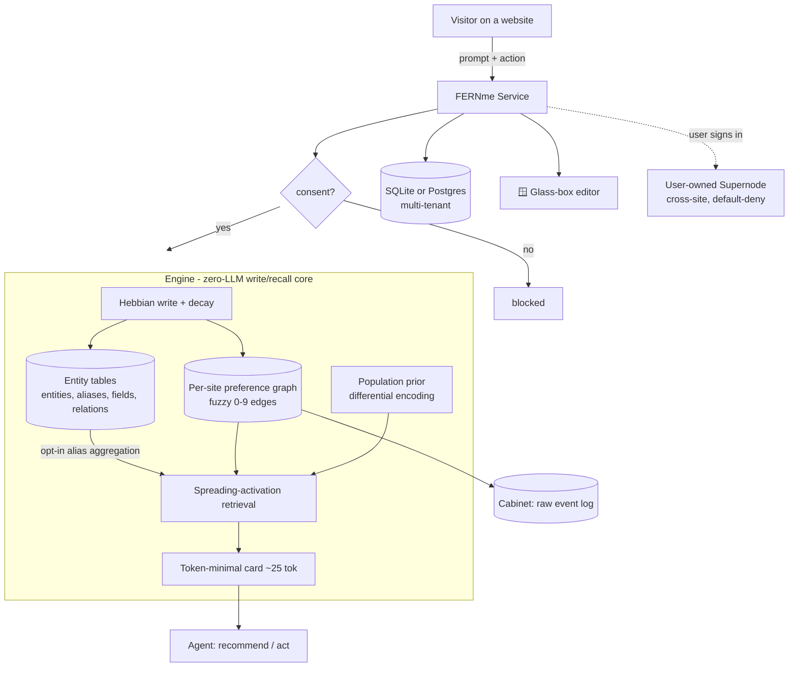
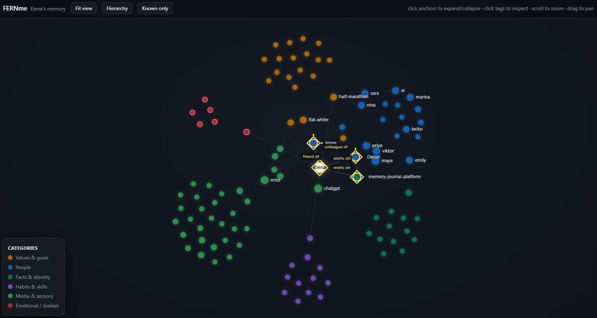

<div align="center">

# 🌿 FERNme

### Fuzzy-Edged Recall Network

*Agent personalization memory that models the user, not the transcript.*

**A user-owned personalization memory layer for AI agents: zero-LLM deterministic core, with optional low-cost human-approved enrichment. It turns consented interactions into an inspectable model of each person's preferences, habits, communication style, and constraints, staying token-flat as it grows while people can see, edit, delete, and own what agents use to personalize.**

[](LICENSE)
[](https://fernme.dev)
[](https://www.python.org/)
[](#-honest-status)
[](#-architecture)
[](#-honest-status)
[](https://pepy.tech/projects/fernme)

*Cheap to write · flat to read · interpretable by design · owned by the user*

[**fernme.dev**](https://fernme.dev)

</div>

---

## ✨ The one-paragraph pitch

Most agent memory is **written by an LLM on every turn** (expensive, hallucination-prone), **evaluated on question-answering** (not actions), and **assumes a single user**. FERNme is built for the opposite world: agents that act for many people, in any domain. It starts where agents already act today, websites, and builds a user-owned personalization model the person can inspect and control. Each user is a sparse, fuzzily-weighted node in a per-site graph; the graph also supports opt-in typed entities with labeled, Hebbian-weighted relations while the deterministic write/recall core stays at zero LLM calls. Optional propose-only enrichment can add connection suggestions powered by the agent you already use or a model you choose; nothing lands in memory truth until a human accepts it. Retrieval is **spreading activation**, and the prompt-facing card stores only **deviations from a population prior**.

---

## What it is / is not

| FERNme is | FERNme is not |
|---|---|
| A user-owned personalization memory layer for agents | A generic transcript store |
| A fuzzy graph of preferences, habits, style, constraints, and outcomes | A folder of chat logs with search |
| Deterministic-first memory writes with optional LLM enrichment | An LLM extraction call on every turn |
| A bounded prompt card that stays small as memory grows | Full-history injection |
| An inspectable and editable user model | Hidden behavioral profiling |
| Consent-first, per-site, default-deny sharing | Cross-site surveillance |

---

## 🎯 Why FERNme (the strong points)

| | |
|---|---|
| **Zero-LLM deterministic core** | Every write and recall runs with no model calls and bounded cost. Optional opt-in enrichment only proposes connections for human approval, powered by the agent you already use or a model you choose. |
| 📉 **Flat token cost forever** | The prompt card holds **~25 tokens** whether it's a visitor's first day or fifth year. A full-history baseline is **77.4× larger** by 120 interactions. |
| 🧠 **Measured trade-offs, no collapse** | The unified synthetic harness is the README source of truth: FERNme stays zero-call and token-flat across static, abrupt/gradual drift, staleness, context, fragmented-entity, and outcome regimes. It does not win every table, but it is the only method with entity aggregation and an outcome feedback loop. |
| 🧬 **Typed people & relations** | Entities with aliases, contact fields, labeled relations (`ceo_of`, `family_of`, ...), and inert relation facts strengthened Hebbian-style; deterministic path queries; opt-in and byte-identical when off. |
| **Suggest-and-approve canonicalization** | Deterministic alias/entity-link candidates land in a human review queue. Rejections stick, accepted suggestions use existing reversible entity alias APIs, and nothing auto-applies to memory truth. |
| 🪟 **Glass-box & user-owned** | Every preference is visible and editable. People fix what's wrong, delete everything, or export it. Privacy becomes a feature, not a liability. |
| 🏬 **Built for outcomes** | Evaluated by **conversion**, not QA. A simulated storefront shows **+17% conversion lift** vs. non-personalized recommendations. |
| 🧩 **User-owned supernode** | Sign in across sites → your memories assemble like Lego into one profile **you control**, default-deny, sensitive data walled off. Not surveillance — the mirror image of it. |
| **Cost/quality dial** | One engine, a default-off enrichment gate: free key-less `pure` by default, optional agent/model proposal sources when you need typed links and relation candidates, and human approval before truth changes. |
| 🔐 **Verifiable & unlearnable** | Every action is logged in a tamper-evident HMAC chain the user can replay to detect any alteration; `forget_everywhere` wipes the profile **and** unlearns the person from the population prior — provable right-to-be-forgotten. |
| 🛡 **Injection-proof by design** | Writes are arithmetic, not LLM extraction, so page/user text can't be "talked into" becoming a belief — tested that injected instructions never enter memory. |
| 🧠 **Private collective intelligence** | New users benefit from crowd patterns on turn one (cold-start from a population prior), with **k-anonymity + differential privacy** so no individual leaks. A network-effect moat single-user memories can't have. |
| **Cross-user assoc isolation** | Shared co-occurrence edges are k-suppressed by default (`assoc_min_users=2`): a rare pair from one user stays visible to that user, but cannot influence another user's retrieval until at least two users reinforce it. |
| 🗣 **Style & mood memory** | Learns *how* each person communicates (terse/verbose, formal/casual, energy) and tracks their **mood with trend detection**, so the agent can match tone and notice when someone's frustration is rising — in any domain. |
| 🎯 **Outcome-learning, any goal** | Memory is reinforced by *results* — not just recall. `record_outcome(success)` strengthens what worked and weakens what backfired, where "success" is any goal (purchase, booking, resolved ticket, completed lesson…). |
| 🔍 **Explainable** | Ask `why(user, attr)` — get the evidence (observations + good/bad outcomes + dates). No black box. |
| 🔌 **Deployable plumbing** (research preview; harden per SECURITY.md) | SQLite or **Postgres** (tested on real PG 16), REST + **MCP** servers, consent gating, injection-safe writes, proactive triggers — all tested. |

---

## 📊 Benchmarks

> **Honest scope:** the numbers below are on **synthetic or LLM-authored** data, not real
> users. They validate the *mechanism* and surface failures; a real-human pilot is the
> pending next step. The Mem0 (LLM) head-to-head needs an API key and is not yet run.
> Entity-layer validation includes synthetic acceptance fixtures, the entity micro-eval,
> and one scoped maintainer-copy check; broader real-profile benchmarks are still pending.

### On LLM-authored people (closest to real, agentic ingestion)
A sample of 16 of 92 third-person profiles (ChatGPT-authored), read as **prose only** and
remembered agentically, then scored against hidden answer keys:

| metric | result |
|---|---|
| preference coverage vs. hidden key | **75%** |
| communication style — formality | **100%** |
| mood sign / mood arc | **94% / 100%** |
| preference drift detected | **94%** |
| injection attempts ignored | **100%** |
| note → card compression | **7.3×** |

*(The "agent" here is an LLM reading prose, so these reflect agent + engine together — the
engine is solid; the extraction quality is the agent's.)*

### Cost, recall, and Pareto (synthetic, multi-seed)

> Reproduce: `python -m fernme.eval.cost_variance` · `... quality` · `... drift` · `... context` · `... retention` · `... ablation` · `... pilot` · `... entities`

> Unified harness: `python -m fernme.eval.harness --seeds 6 --json reports/eval_harness.json`

> Canonicalization queue: `python -m fernme.eval.canonicalization --seeds 6 --json reports/canonicalization.json`

> Propose-only enrichment: `python -m fernme.eval.enrichment --seeds 6 --json reports/enrichment.json`

**Unified Phase 8.1 harness** - synthetic hidden-answer-key scenarios for static,
abrupt drift, gradual drift, staleness, contextual, fragmented-entity, and outcome
regimes. Same events/probes for every method; BM25 reads Cabinet event text with a
pure-Python scorer; all methods in this table make no model calls. Outcome rows include action
quality; non-FERN baselines do not have an outcome feedback mechanism.

| regime | method | recall@5 | precision@5 | stale recall | action | tokens | LLM calls |
|---|---|---:|---:|---:|---:|---:|---:|
| static | FERNme pure | 0.750 +/- 0.000 | 0.600 +/- 0.000 | 0.000 +/- 0.000 | 0.600 +/- 0.000 | 41.7 +/- 0.7 | 0 |
| static | FERNme entities | 0.750 +/- 0.000 | 0.600 +/- 0.000 | 0.000 +/- 0.000 | 0.600 +/- 0.000 | 38.0 +/- 1.2 | 0 |
| static | recency | 0.583 +/- 0.118 | 0.467 +/- 0.094 | 0.000 +/- 0.000 | 0.467 +/- 0.094 | 25.7 +/- 1.1 | 0 |
| static | frequency | 0.958 +/- 0.093 | 0.767 +/- 0.075 | 0.000 +/- 0.000 | 0.767 +/- 0.075 | 26.8 +/- 0.4 | 0 |
| static | BM25 Cabinet | 1.000 +/- 0.000 | 0.800 +/- 0.000 | 0.000 +/- 0.000 | 0.800 +/- 0.000 | 119.8 +/- 35.2 | 0 |
| abrupt drift | FERNme pure | 0.625 +/- 0.125 | 0.500 +/- 0.100 | 0.417 +/- 0.118 | 0.500 +/- 0.100 | 40.8 +/- 4.5 | 0 |
| abrupt drift | FERNme entities | 0.625 +/- 0.125 | 0.500 +/- 0.100 | 0.417 +/- 0.118 | 0.500 +/- 0.100 | 40.8 +/- 4.5 | 0 |
| abrupt drift | recency | 1.000 +/- 0.000 | 0.800 +/- 0.000 | 0.000 +/- 0.000 | 0.800 +/- 0.000 | 28.7 +/- 0.9 | 0 |
| abrupt drift | frequency | 0.292 +/- 0.093 | 0.233 +/- 0.075 | 0.958 +/- 0.093 | 0.233 +/- 0.075 | 29.3 +/- 0.7 | 0 |
| abrupt drift | BM25 Cabinet | 0.250 +/- 0.000 | 0.200 +/- 0.000 | 1.000 +/- 0.000 | 0.200 +/- 0.000 | 907.3 +/- 30.6 | 0 |
| gradual drift | FERNme pure | 0.625 +/- 0.000 | 1.000 +/- 0.000 | 0.000 +/- 0.000 | 1.000 +/- 0.000 | 48.7 +/- 0.5 | 0 |
| gradual drift | FERNme entities | 0.625 +/- 0.000 | 1.000 +/- 0.000 | 0.000 +/- 0.000 | 1.000 +/- 0.000 | 48.7 +/- 0.5 | 0 |
| gradual drift | recency | 0.562 +/- 0.062 | 0.900 +/- 0.100 | 0.000 +/- 0.000 | 0.900 +/- 0.100 | 31.0 +/- 0.6 | 0 |
| gradual drift | frequency | 0.562 +/- 0.062 | 0.900 +/- 0.100 | 0.167 +/- 0.167 | 0.900 +/- 0.100 | 32.5 +/- 0.5 | 0 |
| gradual drift | BM25 Cabinet | 0.479 +/- 0.047 | 0.767 +/- 0.075 | 0.389 +/- 0.124 | 0.767 +/- 0.075 | 86.0 +/- 17.0 | 0 |
| staleness | FERNme pure | 0.714 +/- 0.000 | 1.000 +/- 0.000 | 0.000 +/- 0.000 | 1.000 +/- 0.000 | 36.7 +/- 2.7 | 0 |
| staleness | FERNme entities | 0.714 +/- 0.000 | 1.000 +/- 0.000 | 0.000 +/- 0.000 | 1.000 +/- 0.000 | 36.7 +/- 2.7 | 0 |
| staleness | recency | 0.714 +/- 0.000 | 1.000 +/- 0.000 | 0.000 +/- 0.000 | 1.000 +/- 0.000 | 32.0 +/- 0.6 | 0 |
| staleness | frequency | 0.571 +/- 0.000 | 0.800 +/- 0.000 | 0.250 +/- 0.000 | 0.800 +/- 0.000 | 31.8 +/- 0.4 | 0 |
| staleness | BM25 Cabinet | 0.714 +/- 0.000 | 1.000 +/- 0.000 | 0.000 +/- 0.000 | 1.000 +/- 0.000 | 58.7 +/- 16.6 | 0 |
| contextual | FERNme pure | 0.750 +/- 0.144 | 0.600 +/- 0.115 | 0.000 +/- 0.000 | 0.600 +/- 0.115 | 42.5 +/- 0.5 | 0 |
| contextual | FERNme entities | 0.750 +/- 0.144 | 0.600 +/- 0.115 | 0.000 +/- 0.000 | 0.600 +/- 0.115 | 42.5 +/- 0.5 | 0 |
| contextual | recency | 0.542 +/- 0.093 | 0.433 +/- 0.075 | 0.000 +/- 0.000 | 0.433 +/- 0.075 | 28.5 +/- 1.0 | 0 |
| contextual | frequency | 0.583 +/- 0.118 | 0.467 +/- 0.094 | 0.000 +/- 0.000 | 0.467 +/- 0.094 | 28.5 +/- 0.5 | 0 |
| contextual | BM25 Cabinet | 1.000 +/- 0.000 | 0.800 +/- 0.000 | 0.000 +/- 0.000 | 0.800 +/- 0.000 | 842.0 +/- 0.0 | 0 |
| fragmented entity | FERNme pure | 0.000 +/- 0.000 | 0.000 +/- 0.000 | 0.000 +/- 0.000 | 0.000 +/- 0.000 | 47.7 +/- 0.9 | 0 |
| fragmented entity | FERNme entities | 0.500 +/- 0.500 | 0.100 +/- 0.100 | 0.000 +/- 0.000 | 0.100 +/- 0.100 | 43.8 +/- 3.0 | 0 |
| fragmented entity | recency | 0.000 +/- 0.000 | 0.000 +/- 0.000 | 0.000 +/- 0.000 | 0.000 +/- 0.000 | 30.2 +/- 1.8 | 0 |
| fragmented entity | frequency | 0.000 +/- 0.000 | 0.000 +/- 0.000 | 0.000 +/- 0.000 | 0.000 +/- 0.000 | 31.0 +/- 0.0 | 0 |
| fragmented entity | BM25 Cabinet | 0.000 +/- 0.000 | 0.000 +/- 0.000 | 0.000 +/- 0.000 | 0.000 +/- 0.000 | 90.0 +/- 0.0 | 0 |
| outcome | FERNme pure | 0.500 +/- 0.000 | 0.500 +/- 0.000 | 0.000 +/- 0.000 | 0.500 +/- 0.000 | 30.0 +/- 0.0 | 0 |
| outcome | FERNme entities | 0.500 +/- 0.000 | 0.500 +/- 0.000 | 0.000 +/- 0.000 | 0.500 +/- 0.000 | 30.0 +/- 0.0 | 0 |
| outcome | recency | 0.000 +/- 0.000 | 0.000 +/- 0.000 | 0.000 +/- 0.000 | 0.000 +/- 0.000 | 28.0 +/- 0.0 | 0 |
| outcome | frequency | 0.000 +/- 0.000 | 0.000 +/- 0.000 | 0.000 +/- 0.000 | 0.000 +/- 0.000 | 28.0 +/- 0.0 | 0 |
| outcome | BM25 Cabinet | 0.000 +/- 0.000 | 0.000 +/- 0.000 | 0.000 +/- 0.000 | 0.000 +/- 0.000 | 60.0 +/- 0.0 | 0 |

Read this as a quality gate, not a victory lap: BM25 wins when query text directly
matches Cabinet prose but spends far more context tokens; recency wins the deliberately
abrupt drift fixture; frequency fails staleness; entity flags matter on fragmented
identity; and only FERNme exercises the outcome loop. FERNme stays compact and
zero-call, but it does not dominate every synthetic regime.

**Cost** — per-turn memory tokens vs. profile size (5 seeds):

| metric | FERNme | baseline |
|---|---|---|
| card size | **25.1 ± 0.6 tokens** (flat) | full history grows linearly |
| at 120 interactions | **1×** | **77.4× ± 1.3** larger |
| LLM calls per write | **0** | ~2 (extraction memory) |

Older focused recall modules remain regression checks, but the unified harness
above is the README source of truth for cross-method quality claims.

**Cold-start ablation** — population prior gives **+0.06 precision@5 at turns 1–3**, washing out by turn 10 (a real but modest, cold-start-only benefit).

**Typed-entity A2 micro-eval** (`python -m fernme.eval.entities`) — synthetic,
fictional alias-fragmentation fixture. It reports the rank of a fragmented person
entity with `entity_aggregation` off vs. on. The entity layer also has one scoped
maintainer-copy check listed in Honest status; treat that as n=1 evidence, not a
general real-profile benchmark.

**Suggest-and-approve canonicalization eval** (`python -m fernme.eval.canonicalization --seeds 6 --json reports/canonicalization.json`) - synthetic,
fictional fragmented-alias fixture with planted duplicate aliases. The queue is
propose-only: no candidate changes memory truth unless a human accepts it.

| metric | result |
|---|---:|
| suggestion precision | 1.000 +/- 0.000 |
| suggestion recall | 1.000 +/- 0.000 |
| suggestions per seed | 4.000 +/- 0.000 |

**Propose-only enrichment eval** (`python -m fernme.eval.enrichment --seeds 6 --json reports/enrichment.json`) - synthetic, fictional relation-link fixture with a mock proposal source. OFF is inert; ON reads Cabinet text in a batch, validates proposals, and enqueues suggestions only.

| metric | enrichment OFF | enrichment ON |
|---|---:|---:|
| precision | 0.000 +/- 0.000 | 1.000 +/- 0.000 |
| recall | 0.000 +/- 0.000 | 1.000 +/- 0.000 |
| suggestions | 0.000 +/- 0.000 | 2.000 +/- 0.000 |
| FERNme-initiated LLM calls | 0.000 +/- 0.000 | 1.000 +/- 0.000 |
| recall delta |  | 1.000 |

Agent-driven proposals spend the caller agent's tokens outside FERNme and leave `svc.llm_calls` at 0. This eval is a harness wiring check, not a real-model quality claim.
**Cost / quality status for enrichment** - the old gated/offline Pareto table was modeled before Phase 12. The current backed number is the synthetic propose-only enrichment eval above. Real-model quality and cost are deliberately not claimed until an owner-run model eval exists.
**Simulated outcome pilot** — fake storefront, learn-from-behavior shoppers: **+17% relative conversion lift** over a popularity baseline; tied at visit 1 (cold start), pulling ahead as it learns, recovering through a mid-pilot taste drift.

---

## Memory modes and enrichment

FERNme ships one deterministic memory core with a deployment-level switch: `FernService(memory_mode=...)`. Every hot write and recall stays model-free in every mode. Optional enrichment is a separate, default-off proposal tier.

| path | model use | cost accounting | status |
|---|---|---|---|
| `pure` (default) | none | cheapest, flat | tested, key-less |
| agent proposals | external agent proposes via MCP tools | `svc.llm_calls` remains 0 because FERNme made no call | wired, human-approved |
| batch `enrich(llm_fn=...)` | caller-supplied model function, off hot path | `svc.llm_calls` counts FERNme-initiated batch calls and returns a token estimate | mock-validated synthetic eval |
| no source configured | none | clean no-op | tested graceful skip |

- `propose_relation(...)` and `propose_entity_link(...)` enqueue suggestions into the existing human review queue. Accepting applies through `entity_relate` or `entity_link_alias`; rejecting sticks.
- Model or agent output is untrusted data. Relation vocabulary, entity kind checks, same-surname/low-confidence rules, and injection filters run before anything is enqueued.
- The old `gated`/`offline` mode names remain for compatibility, but they do not write model-derived truth during `observe`. `consolidate()` is now a compatibility wrapper around propose-only enrichment.
- See the synthetic enrichment eval above for the current measured ON/OFF delta with a mock proposal source. Real-model numbers are owner-run only.
## 🧭 The 9 leapfrog dimensions (status)

FERNme's edge isn't the mechanism (that's now a crowded 2026 category) — it's competing
on dimensions single-user, vendor-owned, recall-optimized systems **structurally can't**.

| # | Dimension | Status |
|---|---|---|
| 9 | **Communication-style & mood memory** | ✅ built + tested |
| 2 | **Outcome-learning for any goal** (reinforce on results) | ✅ built + tested |
| 8 | **Explainable provenance** (`why`) | ✅ built + tested |
| - | **Persisted edge provenance** (`stated` vs `inferred`) | built + tested |
| - | **Typed identity entities + relations** | validated on synthetic acceptance fixtures; no real-profile validation yet |
| - | **Entity-aware card aggregation/enrichment** | validated on synthetic acceptance fixtures; no real-profile validation yet |
| 1 | **Private collective priors** (network-effect cold-start; k-anonymity + bounded-mean DP) | ✅ built + tested |
| 4 | **Verifiable, cryptographic data ownership** (tamper-evident HMAC chain, cascading unlearning) | ✅ built + tested |
| 7 | **Multi-timescale memory** (fast context vs. slow identity) | ✅ built + tested |
| 6 | **Self-tuning forgetting** (learn decay from outcomes; adapts to drift) | ✅ built + tested |
| 5 | **Injection-resistant by construction** (deterministic writes can't be talked into beliefs) | ✅ built + tested |
| 3 | **Open user-owned memory protocol** (portable across any agent, with consent) | ◑ spec stage |

> These are deliberately the things HippoGraph et al. can't follow: they're single-user
> (no collective priors), vendor-owned (no user-owned protocol), and recall-optimized
> (no outcome loop). Built in honest, tested slices — research-dependent ones are marked.

## 🏗 Architecture



---

## 🧠 How FERNme works (visual walkthrough)

| | |
|---|---|
| <br/>**Why FERNme** - adaptive local memory instead of expensive RAG/vector retrieval in the loop. | <br/>**Core principles** - zero-LLM deterministic core, optional human-approved enrichment, Hebbian, fuzzy, memory cards, action-aware, user-owned. |
| <br/>**How memory grows** — new event → connect → strengthen → decay → update the card. | <br/>**Fuzzy Hebbian graph** — sparse, weighted (0–9) edges for users, preferences, topics, and goals. |
| <br/>**Propose-only enrichment** - agent/model suggestions go to review; nothing auto-writes truth. | <br/>**Memory card** - bounded, interpretable, token-minimal context for the agent. |
| <br/>**Action-aware learning** - good outcomes strengthen connections, bad outcomes weaken them. | <br/>**Architecture** - ingestion bridge -> vocabulary -> fuzzy graph -> memory card -> agent, with optional proposal enrichment off the hot path. |

**Interactive memory map demo:** the static Elena map in `demo/elena/` is a
screenshot-ready synthetic graph. It now shows the entity-kind view (owner,
person, org, project, and info markers), alias grouping, typed relation edges
(`friend_of`, `colleague_of`, `works_on`), relation-fact badges, and inspectable
edge facts.



*Elena's memory (fictional demo) — glass-box memory map with typed entities, relation facts, and labeled relations. Every node inspectable, every edge explainable.*

## 🚀 Quickstart

```bash
pip install -e ".[dev,api]"

python run_demo.py                      # cold-start → learning → glass-box edit
python supernode_demo.py                # one person, three sites, one owned profile
python -m pytest tests -q               # 246 passing, 2 skipped

# experiments
python -m fernme.eval.drift               # FERNme beats a frequency counter when tastes change
python -m fernme.eval.retention           # permanent facts persist while stale volatile facts fade
python -m fernme.eval.pilot               # +17% simulated conversion lift

# run it live
FERNME_API_KEY=secret uvicorn fernme.api.rest:app --port 8077   # REST API (docs at /docs)
open http://localhost:8077/ui                               # glass-box memory editor
open http://localhost:8077/graph                            # your memory as a graph — focus by site / PC / phone
fernme-mcp                                                   # MCP server for agents/Codex/Claude
```

> 🗄 **Storage:** defaults to `~/.fernme/fernme.db` (SQLite). For production use `PostgresStore` — same interface, tested against a real Postgres 16. Keep SQLite off cloud-synced folders.

### MCP and plugin packaging

Install the MCP extra before running the packaged server:

```bash
pip install -e ".[mcp]"
fernme-mcp
```

Bundled local plugin manifests live under `packaging/`:

```bash
codex plugin marketplace add ./packaging/codex
claude plugin marketplace add ./packaging/claude
```

The Codex package includes `.codex-plugin/plugin.json`, `.mcp.json`, and a
`fernme-memory` skill. The Claude Code/Cowork package follows the current
`.claude-plugin/plugin.json` plus `.mcp.json` layout; CLI validation depends on a
local `claude` install. Both launch the same `fernme-mcp` console script and use
environment-only configuration. See `docs/mcp.md`.

---

## Minimal API example

```python
from fernme.service import FernService

svc = FernService(db_path=":memory:")
svc.consent("shop.example", "elena", True)

svc.observe(
    "shop.example",
    "elena",
    "chat",
    {
        "tags": ["pref:concise", "pref:oat_milk"],
        "text": "Elena prefers concise answers and oat milk.",
    },
)

print(svc.card("shop.example", "elena")["wire"])
```

Typed entities are opt-in (`entities=True`, `entity_aggregation=True`):

```python
from dataclasses import replace; from fernme.config import DEFAULT
svc = FernService(db_path=":memory:", cfg=replace(DEFAULT, entities=True, entity_aggregation=True)); svc.consent("demo.example", "alex", True)
alex = svc.entity_create("demo.example", "alex", "person", "Alex Chen")
dana = svc.entity_create("demo.example", "alex", "person", "Dana Reyes")
svc.entity_relate("demo.example", "alex", alex, "friend_of", dana)
print(svc.recall_path("demo.example", "alex", alex, dana))
```

---

## 🧱 What's inside

- **Engine** - zero-model-call Hebbian write/recall core, ACT-R decay, spreading activation, token-minimal card.
- **Population prior** — IDF cold-start; differential (deviation-only) storage is
  enforced by an explicit `prune_to_prior` pass (redundant edges read through to the prior).
- **Stores** — `SQLiteStore` (zero-setup) and `PostgresStore` (tested vs real PG 16), one interface.
- **Ingestion bridge** - a per-site **catalog** (item_id->tags) plus a controlled namespaced vocabulary (`vocabulary.py`) that canonicalizes catalog, free-text, and agent-supplied tags to one form (`pref:`, `topic:`, `goal:`, `context:`) so the same concept does not drift across months. Enrichment proposals are separate and human-approved.
- **Structured-field capture** — regex-only contact/date extraction keeps email,
  phone, URL, handle, and ISO-date values in the Cabinet payload as data, not tags.
- **Typed entity layer** - opt-in service APIs and additive SQLite/Postgres tables for entities, tag aliases, fields, Hebbian typed relations, relation facts, alias aggregation, and compact entity-aware card enrichment behind default-off flags.
- **Propose-only enrichment** - default-off `propose_relation`, `propose_entity_link`, and batch `enrich(llm_fn=...)` validation into the existing suggestion queue; human accept/reject is the only truth write trigger.
- **The Cabinet** — append-only event log with `recall()` for specific facts.
- **Edge provenance** — persisted `stated`/`inferred` authority metadata on graph
  edges across SQLite, Postgres, and consolidation undo.
- **Supernode** (`supernode.py` + `auth.py`) — user-owned cross-site profile, built by **sign-in** (verified token → opaque person id), default-deny scoped views, sensitive categories walled off.
- **Proactive triggers** — due-to-reorder + fading-favorite nudges.
- **Safety** — event tags treated as untrusted data: injection-pattern dropping, size/value caps.
- **Interfaces** — REST (`/observe /card /recall /edit /export /delete /triggers …`) + MCP tools + a **glass-box web UI** (editor at `/ui`, cross-surface memory graph at `/graph` — one memory, focusable by site / PC / phone).
- **Governance** — consent-gated everywhere; export & right-to-be-forgotten built in.

---

## 🔬 How FERNme compares

FERNme is a **different category** from conversational memories — it is a user-owned personalization graph evaluated by *actions*, not a transcript store optimized for QA recall. Don't benchmark it only on LoCoMo; that's the wrong axis.

| | 🌿 FERNme | Mem0 | Zep/Graphiti | Letta | MemOS |
|---|:--:|:--:|:--:|:--:|:--:|
| Write | **zero-LLM deterministic core; optional propose-only enrichment** | LLM | LLM-built KG | LLM-paged | LLM |
| Typed relations | deterministic, opt-in entity/relation graph | LLM-extracted memories | LLM-built KG per episode | model-managed pages | hybrid |
| Retrieval | spreading activation | vector | graph+time | OS paging | hybrid |
| Eval axis | **outcomes** | QA | temporal QA | long-horizon | QA |
| User-owned + glass-box | **✅** | – | – | – | – |
| Multi-tenant per-site | **✅** | passport | – | – | – |

**Leads on:** write cost, interpretability, per-site user-ownership/consent. **Honestly behind on:** nuanced/causal preferences (LLM extraction wins), benchmark credibility, ecosystem & distribution.

---

## ⚖️ Honest status

Done & tested (246 passing, 2 skipped): engine, SQLite + real-Postgres stores, supernode + sign-in, triggers, safety, REST/MCP, glass-box UI + memory-graph view, class-targeted volatility retention, contradiction-scoped verify, persisted edge provenance, structured-field ingest, suggest-and-approve canonicalization, cross-user assoc k-suppression, MCP packaging smoke coverage, and the full results suite above.

🆕 **Typed entity layer:** deterministic, consent-gated service APIs plus additive
SQLite/Postgres tables for entities, aliases, fields, typed relations, and inert
relation facts with Hebbian strengthening/decay. Opt-in retrieval integration can aggregate fragmented
aliases and enrich card slots with compact entity context. It is validated on
synthetic acceptance fixtures and the `python -m fernme.eval.entities` micro-eval;
First real-profile validation (n=1, maintainer's own 722-tag profile): with entity flags on, a fragmented person's card rank improved 11→6, a previously-missed contact_of relationship surfaced in the card, and token cost stayed flat (~150 vs ~155). Synthetic-vs-real caveat applies: one profile, one probe set. Structured-field ingest now retains email, phone, URL, handle, and ISO-date extractions in event payloads as Cabinet data; entity-field writes are available through the service API, with automatic promotion left for a later pass.

**Suggest-and-approve canonicalization:** deterministic alias-merge and
entity-link suggestions are persisted per site/user for human review. This is
synthetic-validated by `python -m fernme.eval.canonicalization` (precision
1.000 +/- 0.000, recall 1.000 +/- 0.000 on planted duplicate aliases), opt-in at
the service/API layer, and propose-only: rejected suggestions do not resurface,
and accepted suggestions apply through existing entity alias APIs.

**Propose-only enrichment:** default-off agent/model proposal surfaces enqueue typed relation and entity-link candidates into the same review queue. With enrichment disabled, outputs are byte-identical and `propose_*`/`enrich()` are inert. With enrichment enabled, proposals are sanitized, vocabulary/entity-kind checked, counted when dropped, and never written to memory truth until accepted by a human. Synthetic mock eval: precision 1.000 +/- 0.000, recall 1.000 +/- 0.000, 2.000 suggestions/seed, and 1.000 FERNme-initiated batch LLM call/seed. Agent-driven proposals make 0 FERNme LLM calls.
**Cross-user assoc isolation:** assoc graph reads are k-suppressed by default
(`assoc_min_users=2`). This is a deliberate privacy-motivated behavior change on
multi-user sites: one user's rare co-occurrence pair cannot influence another
user's retrieval until at least two distinct users reinforce it. Single-user sites
are unchanged because each user's own assoc contributions remain visible to them;
`assoc_min_users=1` is the compatibility escape hatch for the old shared-site
behavior.

🆕 **New default behavior:** class-targeted volatility retention is on by default. Permanent facts use very long retention, volatile/current facts fade fast, and drift-tested taste classes stay short. Synthetic R5 retention eval: permanent facts above floor at day 700 improve **0.000 -> 1.000**, stale volatile weight improves **2.114 -> 0.000**, and slow changed facts still prefer the new value **1.000**. Legacy focused drift checks remain regression coverage; cross-method claims use the unified harness above.

🆕 **Verify scope:** contradiction-scoped verify is on for genuine single-value-slot conflicts and marks only the older side of the contradiction. Synthetic R5 eval: contradicted-stale verify precision **1.000**, recall **1.000**, nag **0.000**, with **0.959 +/- 0.156** conflict pairs/user. The perfect contradicted-stale score is by construction, so it validates wiring, not real-world conflict-detector quality. Confidence separates "keep it" from "trust it"; stale-high-confidence-wrong improves in the fixture (**0.070 -> 0.004**) because middle-class confidence no longer decays slower than flat.

🚧 **Still open (genuinely needs the outside world):**
- A **real-human per-site pilot** — only live users close the loop a simulator can't.
- The **Mem0 (LLM) head-to-head** — harness wired; run locally with `OPENAI_API_KEY`.
- **Embeddings** for context-to-attribute matching; optional propose-only enrichment for messy inputs.
- **Silent staleness verify** -- age-only verify remains off by default. In the synthetic sweep, the best age-only point was still weak (precision **0.461**, recall **0.651**, nag **0.214**), so silent-stale detection needs the next milestone: learned per-edge volatility or outside corroboration.

> Every claim above is backed by a test or a reproducible experiment. Where a result is simulated, it says so — a simulator proves the *mechanism*, not real-world behavior.

---

## 📁 Layout

```
fernme/
  core/      graph types · fuzzy 0–9 edges · event record
  write/     event->attr mapping (zero-model-call core) · Hebbian update · decay
  retrieve/  base-level + spreading activation · token-minimal card · entity_card.py
  capture/   adapters · extractors.py (regex-only structured fields)
  prior/     population prior · differential encoding · IDF cold-start
  store/     sqlite_store · postgres_store (one interface)
  relations.py · typed entity/relation vocabulary
  supernode.py · auth.py · triggers.py · safety.py · service.py
  api/       rest.py (FastAPI) · mcp_server.py · web/glassbox.html · web/graph.html
  eval/      simulator - cost - quality - drift - context - ablation - pilot - entities - harness - enrichment
tests/       246 passing, 2 skipped   ·   *_demo.py walkthroughs
```

---

## 📜 License & citation

Apache-2.0, © 2026 Acquilab Inc. — see [LICENSE](LICENSE) and [NOTICE](NOTICE). Security notes in [SECURITY.md](SECURITY.md); the name is a working codename (see [NAMING.md](NAMING.md)).
If you use FERNme in research, please cite it via [CITATION.cff](CITATION.cff).

<div align="center">
<sub>Research preview. Benchmarks are synthetic or LLM-authored unless stated otherwise.</sub>
</div>
