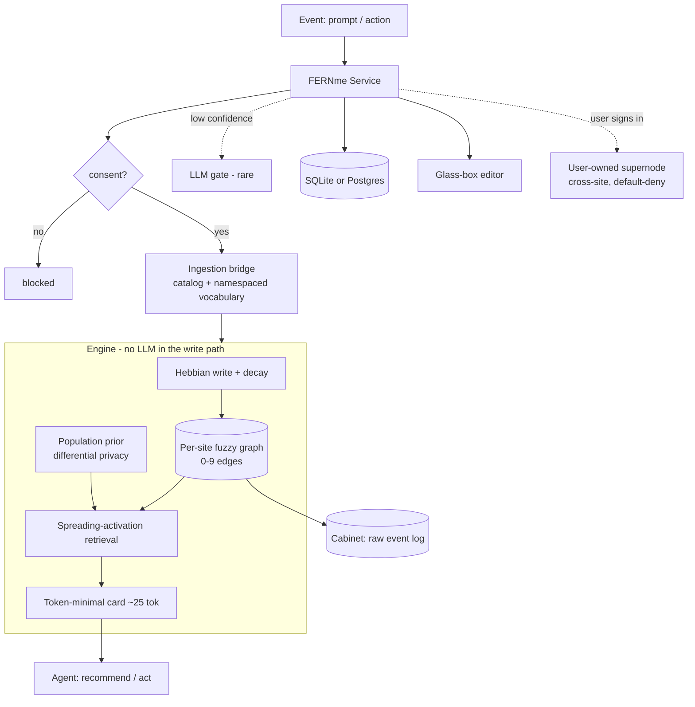

# Architecture

FERNme is one engine with a deterministic hot path; the LLM is an optional, rare fallback.

## Flow
1. **Ingestion bridge** turns input into canonical tags — deterministically via a per-site catalog/vocabulary, or (rarely) via a gated LLM for novel free text.
2. **Hebbian write** bumps fuzzy 0–9 edges; **decay** fades the unused. No LLM.
3. **Spreading activation** retrieves the relevant slice; the **population prior** fills cold-start gaps (privately).
4. The **memory card** (~25 tokens) is what the agent sees each turn.
5. The **Cabinet** keeps the raw event log for specific-fact recall.
6. **Outcomes** feed back to strengthen/weaken what worked.

## Modules (`fernme/`)
| Module | Role |
|---|---|
| `core/` | graph types, fuzzy 0–9 edges, event record |
| `write/` | event→attr mapping (no LLM), Hebbian update, decay |
| `retrieve/` | base-level + spreading activation, card compile |
| `prior/` | population prior, differential encoding, IDF cold-start |
| `store/` | `sqlite_store`, `postgres_store` (one interface) |
| `vocabulary.py` | controlled namespaced tag vocabulary (ingestion) |
| `tagging.py` | deterministic + optional LLM tagger |
| `confidence.py` | multi-signal confidence + act/observe/ask gate |
| `dp.py` | k-anonymity + differential-privacy collective priors |
| `supernode.py` / `auth.py` | user-owned cross-site profile + sign-in linking |
| `triggers.py` | proactive nudges (reorder, fading favorite) |
| `safety.py` | untrusted-input sanitization |
| `audit.py` | tamper-evident HMAC log + right-to-be-forgotten |
| `service.py` | the consent-gated API tying it together |
| `api/` | REST (`rest.py`), MCP (`mcp_server.py`), glass-box UI |
